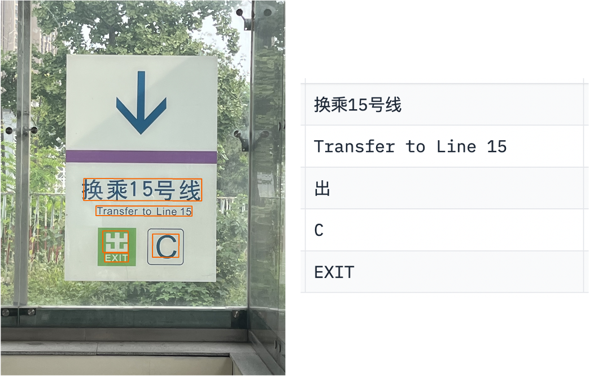
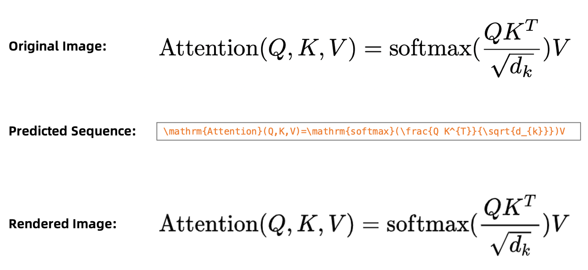
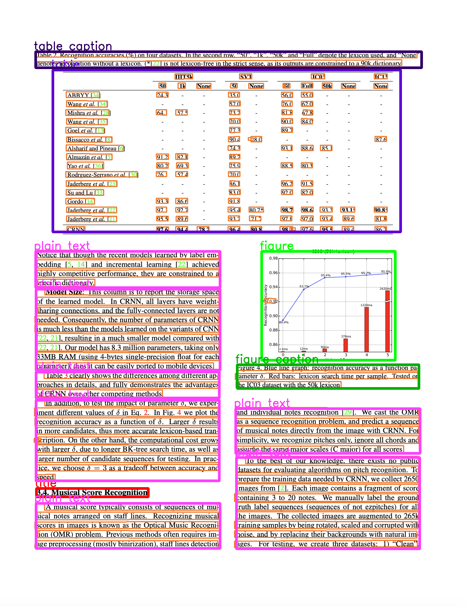

# DocXChain: A Powerful Open-Source Toolchain for Document Parsing and Beyond

## Introduction

<font color=#FFA500 size=3> ***"Make Every Unstructured Document Literally Accessible to Machines"*** </font>

Documents are ubiquitous, since they are excellent carriers for recording and spreading information across space and time. Documents have been playing a critically important role in the daily work, study and life of people all over the world. Every day, billions of documents in different forms are created, viewed, processed, transmited and stored around the world, either physically or digitally. However, not all documents in the digital world can be directly accessed by machines (including computers and other automatic equipments), as only a portion of the documents can be successfully parsed with low-level procedures. For instance, the [Adobe Extract APIs](https://developer.adobe.com/document-services/docs/overview/pdf-extract-api/) are able to directly convert the metadata of born-digital PDF files into HTML-like trees, but would completely fail when handling PDFs generated from photographs produced by scanners or images captured by cameras. Therefore, if one would like to make documents that are not born-digital conveniently and instantly accessible to machines, a powerful toolset for extracting the structures and contents from such unstructured documents is of the essence.

DocXChain is a powerful open-source toolchain for document parsing, which can convert the rich information in ***unstructured documents***, such as text, tables and charts, into ***structured representations*** that are readable and manipulable by machines. Currently, basic capabilities, including text detection, text recognition, table structure recognition, mathematical formula recognition and layout analysis, are provided. In addition, upon these basic capabilities, we also build typical pipelines, i.e., text reading, table parsing, document structurization and whole PDF conversion, to drive more complicated applications related to documents in real-world scenarios.

DocXChain is designed and developed with the original aspiration of ***promoting the level of digitization and structurization for documents***. In the future, we will go beyond pure document parsing capabilities, to explore more possibilities, e.g., combining DocXChain with large language models (LLMs) to perform document information extraction (IE), question answering (QA) and retrieval-augmented generation (RAG).

For more details, please refer to the [technical report](https://arxiv.org/abs/2310.12430) of DocXChain. 

**Notice 1:** In this project, we adopt the ***broad concept of documents***, meaning DocXChain can support various kinds of documents, including regular documents (such as books, academic papers and business forms), street view photos, presentations and even screenshots.

**Notice 2:** You are welcome to experience our online PoC system [DocMaster](https://www.modelscope.cn/studios/damo/DocMaster/summary), which combines basic document parsing capabilities with LLMs to realize precise document information extraction and question answering.

**Notice 3:** We also provide commercial products (online APIs) for document parsing on Alibaba Could. Please visit the [homepage of DocMind](https://docmind.console.aliyun.com/doc-overview), if you are interested.

## Core Ideology

The core design ideas of DocXChain are summarized as follows:
- **Object:** The central objects of DocXChain are ***documents***, rather than ***LLMs***.
- **Concision:** The capabilities for document parsing are presented in a "modules + pipelines" fashion, while unnecessary abstraction and encapsulation are abandoned.
- **Compatibility:** This toolchain can be readily integrated with existing tools, libraries or models (such as LangChain and ChatGPT), to build more powerful systems that can accomplish more complicated and challenging tasks.

## Qualitative Examples

* Example of General Text Reading:



* Example of Table Parsing:


* Example of Formula Recognition (the image rendered from the LaTeX sequence is produced with the [online system](https://www.latexlive.com/home##) of [LaTeXLive](https://github.com/QianJianTech/LaTeXLive)):



* Example of Document Structurization:



## Installation

* Install basic requirements (Python version >= 3.7):

```
pip install -r requirements.txt
```

* **[Important]** Install ModelScope as well as related frameworks and libraries (such as PyTorch and TensorFlow). Please refer to the [GitHub homepage of ModelScope](https://github.com/modelscope/modelscope) for more details regarding the installation instructions.

* Install ImageMagick (needed to load PDFs):
```bash
apt-get update
apt-get install libmagickwand-dev
pip install Wand
sed -i '/disable ghostscript format types/,+6d' /etc/ImageMagick-6/policy.xml  # run this command if the following message occurs: "wand.exceptions.PolicyError: attempt to perform an operation not allowed by the security policy `PDF'"
```

* Download the layout analysis model (a homebrewed model provided by us):
```bash
wget -c -t 100 -P /home/ https://github.com/AlibabaResearch/AdvancedLiterateMachinery/releases/download/v1.2.0-docX-release/DocXLayout_231012.pth
``` 

* Download the formula recognition models (from [RapidLatexOCR](https://github.com/RapidAI/RapidLatexOCR)):
```bash
wget -c -t 100 -P /home/ https://github.com/AlibabaResearch/AdvancedLiterateMachinery/releases/download/v1.6.0-LaTeX-OCR-models/LaTeX-OCR_image_resizer.onnx
wget -c -t 100 -P /home/ https://github.com/AlibabaResearch/AdvancedLiterateMachinery/releases/download/v1.6.0-LaTeX-OCR-models/LaTeX-OCR_encoder.onnx
wget -c -t 100 -P /home/ https://github.com/AlibabaResearch/AdvancedLiterateMachinery/releases/download/v1.6.0-LaTeX-OCR-models/LaTeX-OCR_decoder.onnx
wget -c -t 100 -P /home/ https://github.com/AlibabaResearch/AdvancedLiterateMachinery/releases/download/v1.6.0-LaTeX-OCR-models/LaTeX-OCR_tokenizer.json
```

## Inference

One can perform inference using the `example.py` script. It can be run as follows:
```bash
python example.py general_text_reading <document_file_path> <output_file_path>  # task: general text reading (dump supports both image and JSON file)
python example.py table_parsing <document_file_path> <output_file_path>  # task: table parsing  (dump supports both image and JSON file)
python example.py formula_recognition  <document_file_path> <output_file_path>  # task: formula recognition (dump supports only JSON file)
python example.py document_structurization <document_file_path> <output_file_path>  # task: document structurization  (dump supports both image and JSON file)
python example.py whole_pdf_conversion <document_file_path> <output_file_path>  # task: whole PDF conversion, i.e., converting all pages of a PDF file into an organized JSON structure (dump supports only JSON file)
``` 

## Citation

If you find our work beneficial, please cite:

```
@article{DocXChain2023,
  title={{DocXChain: A Powerful Open-Source Toolchain for Document Parsing and Beyond}},
  author={Cong Yao},
  journal={ArXiv},
  year={2023}
  url={https://arxiv.org/abs/2310.12430}
}
```

## *License*

DocXChain is released under the terms of the [Apache License, Version 2.0](LICENSE).

```
DocXChain is a toolchain for document parsing and the code and models herein created by the authors from Alibaba can only be used for research purpose.
Copyright (C) 1999-2023 Alibaba Group Holding Ltd. 

Licensed under the Apache License, Version 2.0 (the "License");
you may not use this file except in compliance with the License.
You may obtain a copy of the License at

    http://www.apache.org/licenses/LICENSE-2.0

Unless required by applicable law or agreed to in writing, software
distributed under the License is distributed on an "AS IS" BASIS,
WITHOUT WARRANTIES OR CONDITIONS OF ANY KIND, either express or implied.
See the License for the specific language governing permissions and
limitations under the License.
```