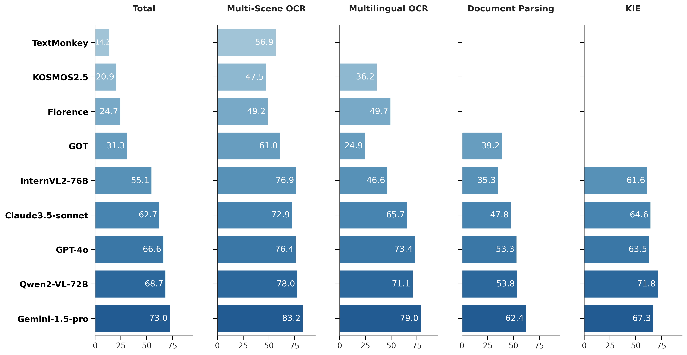
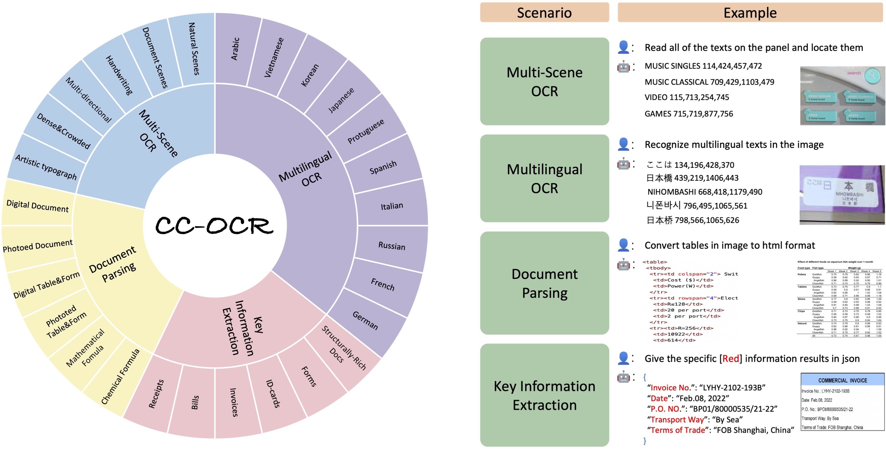

# CC-OCR

This is the Repository for CC-OCR Benchmark.

Dataset and evaluation code for the Paper "CC-OCR: A Comprehensive and Challenging OCR Benchmark for Evaluating Large Multimodal Models in Literacy".

<p align="center">
🚀 <a href="https://github.com/AlibabaResearch/AdvancedLiterateMachinery/tree/main/Benchmarks/CC-OCR">GitHub</a>&nbsp&nbsp | &nbsp&nbsp🤗 <a href="https://huggingface.co/datasets/wulipc/CC-OCR">Hugging Face</a>&nbsp&nbsp | &nbsp&nbsp🤖 <a href="https://www.modelscope.cn/datasets/Qwen/CC-OCR">ModelScope</a>&nbsp&nbsp | &nbsp&nbsp 📑 <a href="https://arxiv.org/abs/2412.02210">Paper</a> &nbsp&nbsp | &nbsp&nbsp📗 <a href="https://zhibogogo.github.io/ccocr.github.io">Blog</a>

</p>

## News
* 2025-04-09 🌟 The table extraction code in doc_parsing [evaluation](evaluation/evaluator/doc_parsing_evaluator.py) has been updated to handle more scenarios.
* 2024-12-27 🚀 CC-OCR is in the PR stage of [VLMEvalKit](https://github.com/open-compass/VLMEvalKit). Please refer to the document ([zh](assets/doc/VLMEvalKit_zh.md) & [en](assets/doc/VLMEvalKit_en.md)) for usage.
* 2024-12-26 🔥 We release CC-OCR, including both data and evaluation script!

## Benchmark Leaderboard


| Model            | Multi-Scene Text Reading | Multilingual Text Reading | Document Parsing | Visual Information Extraction   | Total |
|------------------| --------------- | ------------- | ----------- | ----- |-------|
| Gemini-1.5-pro   | 83.25           | 78.97         | 62.37       | 67.28 | 72.97 |
| Qwen-VL-72B      | 77.95           | 71.14         | 53.78       | 71.76 | 68.66 |
| GPT-4o           | 76.40           | 73.44         | 53.30       | 63.45 | 66.65 |
| Claude3.5-sonnet | 72.87           | 65.68         | 47.79       | 64.58 | 62.73 |
| InternVL2-76B    | 76.92           | 46.57         | 35.33       | 61.60 | 55.11 |
| GOT              | 61.00           | 24.95         | 39.18       | 0.00  | 31.28 |
| Florence         | 49.24           | 49.70         | 0.00        | 0.00  | 24.74 |
| KOSMOS2.5        | 47.55           | 36.23         | 0.00        | 0.00  | 20.95 |
| TextMonkey       | 56.88           | 0.00          | 0.00        | 0.00  | 14.22 |

* The versions of APIs are GPT-4o-2024-08-06, Gemini-1.5-Pro-002, Claude-3.5-Sonnet-20241022, and Qwen-VL-Max-2024-08-09;
* We conducted the all test around November 20th, 2024, please refer to our paper for more information.

## Benchmark Introduction


The CC-OCR benchmark is specifically designed for evaluating the OCR-centric capabilities of Large Multimodal Models. CC-OCR possesses a diverse range of scenarios, tasks, and challenges. CC-OCR comprises four OCR-centric tracks: multi-scene text reading, multilingual text reading, document parsing, and key information extraction. It includes 39 subsets with 7,058 full annotated images, of which 41% are sourced from real applications, being released for the first time.


The main features of our CC-OCR include:
* We focus on four OCR-centric tasks, namely `Multi-Scene Text Reading`, `Multilingual Text Reading`, `Document Parsing`, `Visual Information Extraction`;
* The CC-OCR covers fine-grained visual challenges (i.e., orientation-sensitivity, natural noise, and artistic text), decoding of various expressions, and structured inputs and outputs;

For a detailed introduction to the CC-OCR dataset, see the documents ([zh](assets/doc/data_structure_zh.md) & [en](assets/doc/data_structure_en.md)) and our [paper](https://arxiv.org/abs/2412.02210). 


## Dataset Download
We public the full data of CC-OCR, including images and annotation files. 
You can obtain the full data with the following the [instructions](./data/README.md).


## Evaluation
We officially recommend [VLMEvalKit](https://github.com/open-compass/VLMEvalKit) for evaluation.
Please refer to document ([zh](assets/doc/VLMEvalKit_zh.md) & [en](assets/doc/VLMEvalKit_en.md)) for more information.


Evaluation within this repository is also supported, and we recommend that users first read the documentation ([zh](assets/doc/data_structure_zh.md) & [en](assets/doc/data_structure_en.md)). 
Please edit the "TODO" things in our [example](./example.py) for a quick start.

Example evaluation scripts:

```shell
MODEL_NAME="qwen_vl_max"
OUTPUT_DIR="/your/path/to/output_dir"

# get your key from: https://help.aliyun.com/zh/model-studio/developer-reference/get-api-key
export DASHBOARD_API_KEY="dashscope_api_key"

# multi_scene_ocr
SUB_OUTPUT_DIR=${OUTPUT_DIR}/multi_scene_ocr
python example.py ${MODEL_NAME} index/multi_scene_ocr.json ${SUB_OUTPUT_DIR}
python evaluation/main.py index/multi_scene_ocr.json ${SUB_OUTPUT_DIR}

# multi_lan_ocr
SUB_OUTPUT_DIR=${OUTPUT_DIR}/multi_lan_ocr
python example.py ${MODEL_NAME} index/multi_lan_ocr.json ${SUB_OUTPUT_DIR}
python evaluation/main.py index/multi_lan_ocr.json ${SUB_OUTPUT_DIR}

# doc_parsing
SUB_OUTPUT_DIR=${OUTPUT_DIR}/doc_parsing
python example.py ${MODEL_NAME} index/doc_parsing.json ${SUB_OUTPUT_DIR}
python evaluation/main.py index/doc_parsing.json ${SUB_OUTPUT_DIR}

# kie
SUB_OUTPUT_DIR=${OUTPUT_DIR}/kie
python example.py ${MODEL_NAME} index/kie.json ${SUB_OUTPUT_DIR}
python evaluation/main.py index/kie.json ${SUB_OUTPUT_DIR}
```


## Q&A
For common Q&A, please refer [here](assets/doc/QA.md). If you have any questions, feel free to open an issue for discussion.

## Citation
If you find our work helpful, feel free to give us a cite.

```
@misc{yang2024ccocr,
      title={CC-OCR: A Comprehensive and Challenging OCR Benchmark for Evaluating Large Multimodal Models in Literacy}, 
      author={Zhibo Yang and Jun Tang and Zhaohai Li and Pengfei Wang and Jianqiang Wan and Humen Zhong and Xuejing Liu and Mingkun Yang and Peng Wang and Shuai Bai and LianWen Jin and Junyang Lin},
      year={2024},
      eprint={2412.02210},
      archivePrefix={arXiv},
      primaryClass={cs.CV},
      url={https://arxiv.org/abs/2412.02210}, 
}
```

## License Agreement

The source code is licensed under the [MIT License](./LICENSE) that can be found at the root directory.

## Contact Us

If you have any questions, feel free to send an email to: wpf272043@alibaba-inc.com or xixing.tj@alibaba-inc.com


