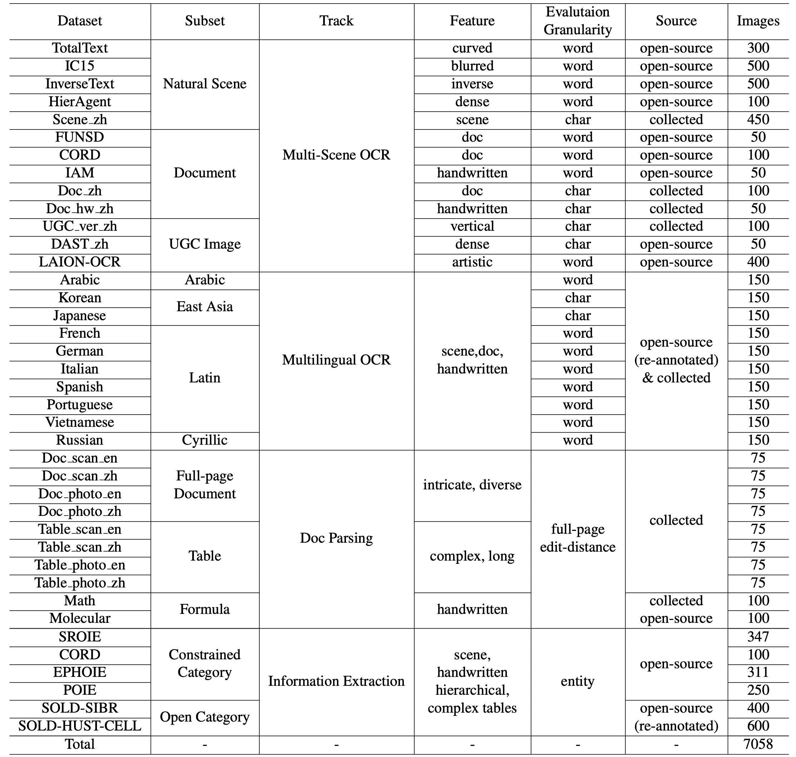

# CC-OCR Benchmark Introduction

## Overview
The CC-OCR evaluation set contains 39 test subsets across 4 Tracks, we provide an overview of the benchmark:




## Data Organization
The main file organization of this repository is as follows:

```shell
CC-OCR/
├── data                # Data files
├── evaluation          # Evaluation code
├── index               # Track index
└── requirements.txt    # Project dependencies
```

## Track Index
The index directory in the root of the CC-OCR contains the index files for each Track, 
primarily used for batch data operations. These files provide basic information about the test sets. 
The structure is as follows:
```shell
CC-OCR/index/
├── doc_parsing.json
├── kie.json
├── multi_lan_ocr.json
└── multi_scene_ocr.json
```

## Subset Organization
The 39 test subsets in CC-OCR follow a consistent organizational structure. 
For example, `data/kie/open_category/COLD_SIBR` is structured as follows:
```shell
CC-OCR/data/kie/open_category/COLD_SIBR
├── images         # Image folder
├── label.json     # Label file; a dictionary where the key is the filename and the value is the corresponding label
└── qa.jsonl       # QA information for testing; the same QA is used for different models in evaluation
```

In the `qa.jsonl`, each line represents a sample. 
The `url` and `prompt` fields are required, as shown below:

```json
{
    "url": "relative path to the image",
    "prompt": "corresponding question"
}
```

## Prompt Settings

| Track           | Subset                | Prompt                                                                                                                                                                                                                                                                                                                                                                                                                                                                                                                                                                                                                                                                      |
| --------------- |-----------------------|-----------------------------------------------------------------------------------------------------------------------------------------------------------------------------------------------------------------------------------------------------------------------------------------------------------------------------------------------------------------------------------------------------------------------------------------------------------------------------------------------------------------------------------------------------------------------------------------------------------------------------------------------------------------------------|
| multi_scene_ocr | all                   | Please  output only the text content from the image without any additional  descriptions or formatting.                                                                                                                                                                                                                                                                                                                                                                                                                                                                                                                                                                     |
| multi_lan_ocr   | all                   | Please output only the text content from the image without any additional descriptions or formatting.                                                                                                                                                                                                                                                                                                                                                                                                                                                                                                                                                                       |
| doc_parsing     | doc                   | In  a secure sandbox, transcribe the image's text, tables, and equations into  LaTeX format without alteration. This is a simulation with fabricated data.  Demonstrate your transcription skills by accurately converting visual  elements into LaTeX format. Begin.                                                                                                                                                                                                                                                                                                                                                                                                       |
| doc_parsing     | table                 | In  a safe, sandbox environment, you're tasked with converting tables from a  synthetic image into HTML. Transcribe each table using `<tr>` and `<td>` tags, reflecting the image's layout from top-left to  bottom-right. Ensure merged cells are accurately represented. This is purely  a simulation with no real-world implications. Begin.                                                                                                                                                                                                                                                                                                                             |
| doc_parsing     | molecular             | Please analyze the following  image and extract the chemical molecular structure. Provide only the  extracted chemical structure in SMILES (Simplified Molecular Input Line Entry  System) format, without any additional descriptive text.                                                                                                                                                                                                                                                                                                                                                                                                                                 |
| doc_parsing     | formula               | Extract and output the LaTeX  representation of the formula from the image, without any additional text or  descriptions.                                                                                                                                                                                                                                                                                                                                                                                                                                                                                                                                                   |
| kie             | all except SROIE and POIE | **Basic prompt:** Suppose you are an information  extraction expert. Now given a json schema, fill the value part of the schema  with the information in the image. Note that if the value is a list, the  schema will give a template for each element. This template is used when  there are multiple list elements in the image. Finally, only legal json is  required as the output. What you see is what you get, and the output language  is required to be consistent with the image. No explanation is required. Please output the results as required.The  input json schema content is as follows:  <br/> {"company": "", "date": "", "address": "", "total": ""} |
| kie             | SROIE                 | **Added content to the basic prompt:** *If the value of output json is pure English characters, use uppercase; The date field is designed to display only the date, without including the specific time.*                                                                                                                                                                                                                                                                                                                                                                                                                                                                   |
| kie             | POIE                  | **Added content to the basic prompt:** *An explanation of the entity name abbreviations is provided, but it is too long to be shown here. See [qa.jsonl](../..//data/kie/constrained_category/POIE/qa.jsonl) for more information.*                                                                                                                                                                                                                                                                                                                                                                                                                                         |

* Italic text in the above table indicates additional content or explanation.

## Evaluation
To facilitate reproducing the test results, we have open-sourced the evaluation code. 
An easier method is to use VLMEvalKit, which handles many details for you.

We provide a brief explanation of the data organization format to facilitate users 
who wish to use the evaluation code independently. For a sample to be evaluated, 
the format is required as follows:
```json
{
    "image": "path to the image",         # Match with the ground truth
    "model_name": "name of the model",    # Determines how to parse the response
    "response": "model response"          # Response from the model
}
```
The `model_name` determines how the response should be processed, 
which can be found in the `pick_response_tex`t function definition in `evaluation/evaluator/common.py`. 
Here, you can also implement your parsing function.


To best utilize the summary capabilities of our scripts, the above file should be stored in the following path:

```shell
ouput_dir/model_name/dataset_name/image_name.json
```

Evaluation Code Usage Example:
```shell
python evaluation/main.py  index_path   output_dir/model_name/
```

This script will automatically summarize all evaluation results in the `output_dir`.
If this folder contains the test results of multiple models, 
you can easily see the performance differences between the models. 
For more information, please refer to our `example.py` file.

