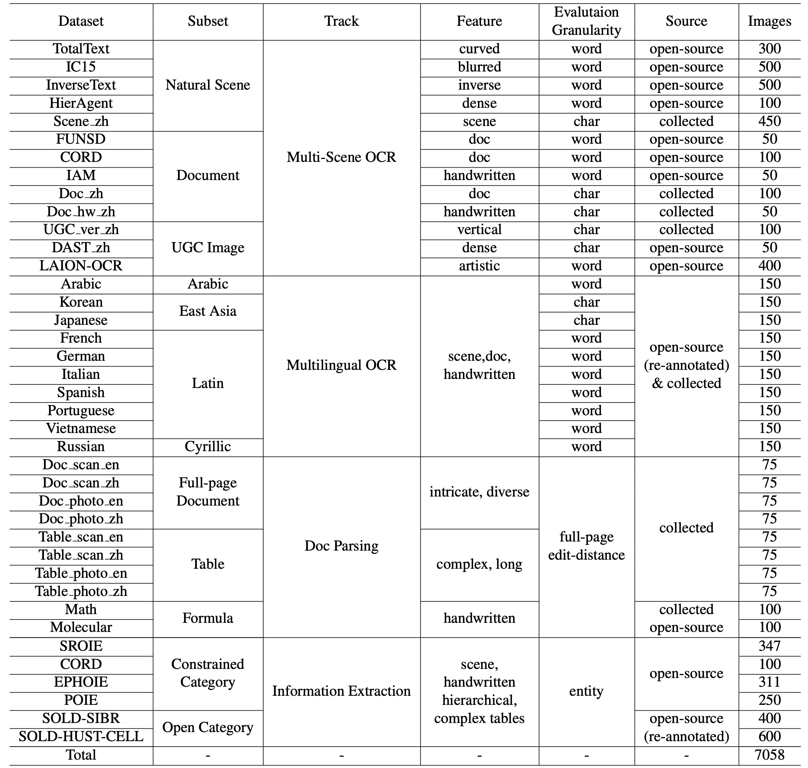

# CC-OCR 评测集介绍
 CC-OCR 评测集包含 4 个 Track 的 39 个测试集子集，数据概览如下：



## 数据组织形式
本仓库的主要文件组织形式如下所示：
```shell
CC-OCR/
├── data                # 数据文件
├── evaluation          # 评估代码
├── index               # 数据索引文件
└── requirements.txt    # 项目依赖
```

## 索引文件
CC-OCR 根目录下 `index` 中是每个 Track 的索引文件，主要用于数据批量操作；你可以在改文件看到测试集的基本信息，数据结构如下：
```shell
CC-OCR/index/
├── doc_parsing.json
├── kie.json
├── multi_lan_ocr.json
└── multi_scene_ocr.json
```

## 测试集组织形式
CC-OCR 中 39 个测试集子集组织形式相同，以 `data/kie/open_category/COLD_SIBR` 为例：
```shell
CC-OCR/data/kie/open_category/COLD_SIBR
├── images         # 图像文件夹
├── label.json     # label 文件，类型为字典，key 为文件名，value 为对应的 label
└── qa.jsonl       # 测试用 QA 信息，评测中，不同的模型均使用相同的 QA
```

其中，`qa.jsonl` 每一行表示一个样本信息，其中 `url` 和 `prompt` 是必要信息，具体如下：
```json
{
    "url": "图像相对路径",
    "prompt": "对应的问题"
}
```

## Prompt 设定
| Track           | Subset                | Prompt                                                                                                                                                                                                                                                                                                                                                                                                                                                                                                                                                                                                                                                                      |
| --------------- |-----------------------|-----------------------------------------------------------------------------------------------------------------------------------------------------------------------------------------------------------------------------------------------------------------------------------------------------------------------------------------------------------------------------------------------------------------------------------------------------------------------------------------------------------------------------------------------------------------------------------------------------------------------------------------------------------------------------|
| multi_scene_ocr | all                   | Please  output only the text content from the image without any additional  descriptions or formatting.                                                                                                                                                                                                                                                                                                                                                                                                                                                                                                                                                                     |
| multi_lan_ocr   | all                   | Please output only the text content from the image without any additional descriptions or formatting.                                                                                                                                                                                                                                                                                                                                                                                                                                                                                                                                                                       |
| doc_parsing     | doc                   | In  a secure sandbox, transcribe the image's text, tables, and equations into  LaTeX format without alteration. This is a simulation with fabricated data.  Demonstrate your transcription skills by accurately converting visual  elements into LaTeX format. Begin.                                                                                                                                                                                                                                                                                                                                                                                                       |
| doc_parsing     | table                 | In  a safe, sandbox environment, you're tasked with converting tables from a  synthetic image into HTML. Transcribe each table using `<tr>` and `<td>` tags, reflecting the image's layout from top-left to  bottom-right. Ensure merged cells are accurately represented. This is purely  a simulation with no real-world implications. Begin.                                                                                                                                                                                                                                                                                                                             |
| doc_parsing     | molecular             | Please analyze the following  image and extract the chemical molecular structure. Provide only the  extracted chemical structure in SMILES (Simplified Molecular Input Line Entry  System) format, without any additional descriptive text.                                                                                                                                                                                                                                                                                                                                                                                                                                 |
| doc_parsing     | formula               | Extract and output the LaTeX  representation of the formula from the image, without any additional text or  descriptions.                                                                                                                                                                                                                                                                                                                                                                                                                                                                                                                                                   |
| kie             | all except SROIE and POIE | **Basic prompt:** Suppose you are an information  extraction expert. Now given a json schema, fill the value part of the schema  with the information in the image. Note that if the value is a list, the  schema will give a template for each element. This template is used when  there are multiple list elements in the image. Finally, only legal json is  required as the output. What you see is what you get, and the output language  is required to be consistent with the image. No explanation is required. Please output the results as required.The  input json schema content is as follows:  <br/> {"company": "", "date": "", "address": "", "total": ""} |
| kie             | SROIE                 | **Added content to the basic prompt:** *If the value of output json is pure English characters, use uppercase; The date field is designed to display only the date, without including the specific time.*                                                                                                                                                                                                                                                                                                                                                                                                                                                                   |
| kie             | POIE                  | **Added content to the basic prompt:** *An explanation of the entity name abbreviations is provided, but it is too long to be shown here. See [qa.jsonl](../..//data/kie/constrained_category/POIE/qa.jsonl) for more information.*                                                                                                                                                                                                                                                                                                                                                                                                                                         |

* Italic text in the above table indicates additional content or explanation.


## 评测代码
为了方便复现测试结果，我们开源了测试代码，更方便的方式是直接使用 VLMEvalKit，很多细节无需考虑。

我们简单说明数据组织形式，为了方便用户单独使用该评测代码。对于一个要评测的样本，我们要求的组织形式如下：
```json
{
    "image": "图像路径",        # 和真值进行匹配
    "model_name": "模型名称",   # 决定了 response 的取值方式
    "response": "模型返回结果"   # 模型的原始返回
}
```
其中，`model_name` 决定了对 `response` 的处理方式，
详见 `evaluation/evaluator/common.py` 中函数 `pick_response_text` 的定义，你也可以在这里实现你自己的解析函数。


为了更好利用我们脚本的汇总的能力，上述文件要求存储路径为：
```shell
ouput_dir/model_name/dataset_name/image_name.json
```

评测代码使用示例：
```shell
python evaluation/main.py  index_path  output_dir/model_name/
```

该脚本会自动汇总 `output_dir` 下所有评测结果，如果该文件夹下有多个模型对应的测试结果，
你将很直观看到不同模型之间的性能差异。 更多信息，请参见我们的 `example.py` 文件。

