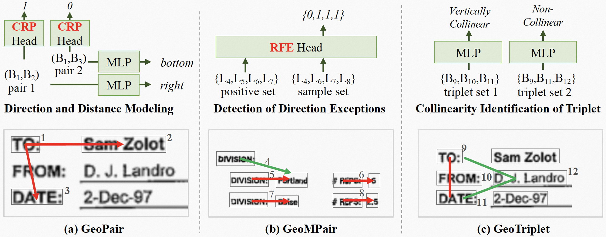

# GeoLayoutLM: Geometric Pre-training for Visual Information Extraction
The official PyTorch implementation of GeoLayoutLM (CVPR 2023 highlight).

## Paper
- [CVPR 2023](https://openaccess.thecvf.com/content/CVPR2023/papers/Luo_GeoLayoutLM_Geometric_Pre-Training_for_Visual_Information_Extraction_CVPR_2023_paper.pdf)
- [arXiv](https://arxiv.org/abs/2304.10759)

GeoLayoutLM is a multi-modal framework for Visual Information Extraction (VIE, including SER and RE), which incorporates the novel **geometric pre-training**.
Additionally, novel **relation heads**, which are pre-trained by the geometric pre-training tasks and fine-tuned for RE, are designed to enrich and enhance the feature representation.
GeoLayoutLM achieves highly competitive scores in the SER task, and significantly outperforms the previous state-of-the-arts for RE.



<!--  -->
## Environment
The dependencies are listed in `requirements.txt`. Please install a proper torch version matching your cuda version first.
```
pip install -r requirements.txt
```

## Model Checkpoints
We released the pre-trained model for downstream fine-tuning.
Also, we provided SER and RE models fine-tuned on FUNSD.

|    | Pre-trained model | SER model | RE model |
|:--:|:-----------------:|:---------:|:--------:|
|Download|[LINK](https://github.com/AlibabaResearch/AdvancedLiterateMachinery/releases/download/v1.1.0-geolayoutlm-model/geolayoutlm_large_pretrain.pt)| [LINK](https://github.com/AlibabaResearch/AdvancedLiterateMachinery/releases/download/v1.1.0-geolayoutlm-model/epoch.105-f1_labeling.0.9232.pt) | [LINK](https://github.com/AlibabaResearch/AdvancedLiterateMachinery/releases/download/v1.1.0-geolayoutlm-model/epoch.182-f1_linking.0.8923.pt) |
| F1 | - | 92.32 | 89.23 |

Note that the training with the vision module causes unstable final performance, i.e., multiple independent experiments will have diffenrent F1 scores.

## Fine-tuning
### Preprocess the data
- FUNSD

[FUNSD](https://guillaumejaume.github.io/FUNSD/) is a dataset for form understanding. It is widely used in the VIE task.
```
cd preprocess/funsd_el/
python preprocess.py
```

### Fine-tune and Evaluate
```
CUDA_VISIBLE_DEVICES=0 python train.py --config=configs/finetune_funsd.yaml
CUDA_VISIBLE_DEVICES=0 python evaluate.py --config=configs/finetune_funsd.yaml [--pretrained_model_file=path/to/xx.pt]
```

## Multi-lingual base model
We also released a base model pre-trained on Chinese and English documents.
Refer to [modelscope](https://www.modelscope.cn/models/damo/multi-modal_convnext-roberta-base_vldoc-embedding/summary) for more details.

## Acknowledgments
We implemented the fine-tuning based on the code of [BROS](https://github.com/clovaai/bros).

## Citation
Please cite our paper if the work helps you.
```
@article{cvpr2023geolayoutlm,
  title={GeoLayoutLM: Geometric Pre-training for Visual Information Extraction},
  author={Chuwei Luo and Changxu Cheng and Qi Zheng and Cong Yao},
  journal={2023 IEEE/CVF Conference on Computer Vision and Pattern Recognition (CVPR)},
  year={2023}
}
```

## License
```
Copyright 2023-present Alibaba Group.

Licensed under the Apache License, Version 2.0 (the "License");
you may not use this file except in compliance with the License.
You may obtain a copy of the License at

    http://www.apache.org/licenses/LICENSE-2.0

Unless required by applicable law or agreed to in writing, software
distributed under the License is distributed on an "AS IS" BASIS,
WITHOUT WARRANTIES OR CONDITIONS OF ANY KIND, either express or implied.
See the License for the specific language governing permissions and
limitations under the License.
```
