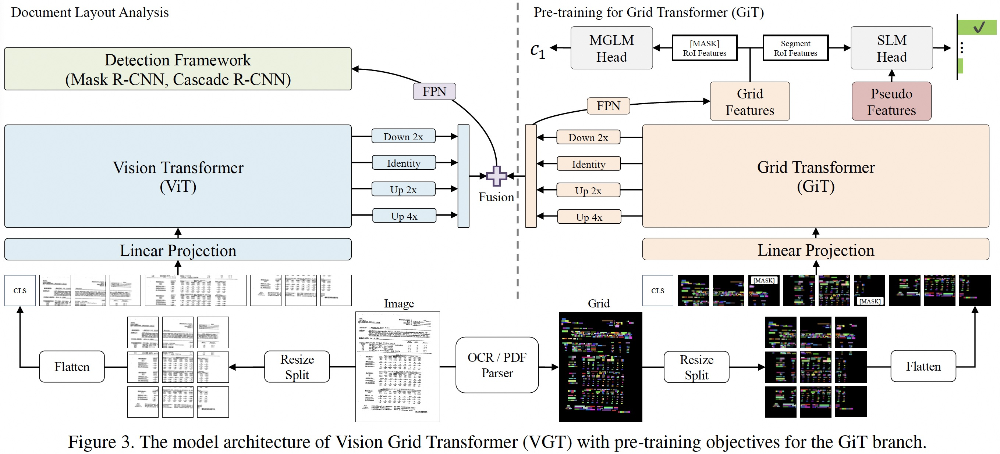

# Vision Grid Transformer for Document Layout Analysis
The official PyTorch implementation of VGT (ICCV 2023).

VGT is a two-stream multi-modal Vision Grid Transformer for document layout analysis, in which Grid Transformer (GiT) is proposed and pre-trained for 2D token-level and segment-level semantic understanding. By fully leveraging multi-modal information and exploiting pre-training techniques to learn better representation, VGT achieves highly competitive scores in the DLA task, and significantly outperforms the previous state-of-the-arts.


## Paper
* [ICCV 2023]
* [Arxiv](https://arxiv.org/abs/2308.14978)




## Install requirements
* [PyTorch](http://pytorch.org/) version >= 1.8.0
* Python version >= 3.6

```bash
pip install -r requirements.txt
# Install `git lfs`
curl -s https://packagecloud.io/install/repositories/github/git-lfs/script.deb.sh | sudo bash
sudo apt-get install git-lfs
```

The required packages including: [Pytorch](https://pytorch.org/) version 1.9.0, [torchvision](https://pytorch.org/vision/stable/index.html) version 0.10.0 and [Timm](https://github.com/rwightman/pytorch-image-models) version 0.5.4, etc.

For mixed-precision training, please install [apex](https://github.com/NVIDIA/apex)
```
git clone https://github.com/NVIDIA/apex
cd apex
pip install -v --disable-pip-version-check --no-cache-dir --global-option="--cpp_ext" --global-option="--cuda_ext" ./
```
For object detection, please additionally install detectron2 library. Refer to the [Detectron2's INSTALL.md](https://github.com/facebookresearch/detectron2/blob/main/INSTALL.md).

```bash
# Install `detectron2`
python -m pip install detectron2==0.6 -f \
    https://dl.fbaipublicfiles.com/detectron2/wheels/cu102/torch1.9/index.html
```

## Pretrained models
We provide the pretrained GiT weights in VGT, which are pretrained by the proposed MGLM and SLM tasks.

| GiT-pretrian |
| :---: |
|[VGT-pretrain-model](https://github.com/AlibabaResearch/AdvancedLiterateMachinery/releases/download/v1.3.0-VGT-release/VGT_pretrain_model.pth)|

For the ViT weights in VGT, please download checkpoints in DiT-base: [dit_base_patch16_224](https://github.com/microsoft/unilm/tree/master/dit)

We load these two weights for VGT training.


## Data Preparation
**PubLayNet** [link](https://github.com/ibm-aur-nlp/PubLayNet/tree/master)

Download the data from this [link](https://dax-cdn.cdn.appdomain.cloud/dax-publaynet/1.0.0/PubLayNet_PDF.tar.gz) (~96GB). 
PubLayNet provides the original PDFs, and we use pdfplumber to generate OCR informantions for grid generation.
Download the grid pkl from [link](https://www.modelscope.cn/datasets/damo/GridforVGT/summary). 
The structure of data folder is as below.

```
publaynet
├── train
│   ├── 1.jpg
├── val
│   ├── 2.jpg
├── test
│   ├── 3.jpg
├── VGT_publaynet_grid_pkl
│   ├── 1.pdf.pkl
│   └── 2.pdf.pkl
├── train.json
├── val.json
├── test.json
```

**Docbank** 

Download the original data `DocBank_500K_ori_img.zip` and `MSCOCO_Format_Annotation.zip` from the Docbank website [link](https://doc-analysis.github.io/docbank-page/index.html).
However, the categories of `MSCOCO_Format_Annotation.zip` are not matched with the dataset. And we provide new annotations with fixed categories in `DocBank.zip` from [link](https://www.modelscope.cn/datasets/damo/GridforVGT/summary).

We use duguang OCR Parser to generate OCR informantions for grid generation.
Download the grid pkl from [link](https://www.modelscope.cn/datasets/damo/GridforVGT/summary). 
The structure of data folder is as below.

```
DocBank
├── DocBank_500K_ori_img
│   ├── 1.jpg
├── VGT_docbank_grid_pkl
│   ├── 1.pkl
│   └── 2.pkl
├── 500K_train_VGT.json
├── 500K_valid_VGT.json
```

**D4LA**

Download the original data (images, annotations and grid) from the D4LA website [link](https://modelscope.cn/datasets/damo/D4LA/summary).
The structure of data folder is as below.

```
D4LA
├── train_images
│   ├── 1.jpg
├── test_images
│   ├── 2.jpg
├── VGT_D4LA_grid_pkl
│   ├── 1.pkl
│   └── 2.pkl
├── json
│   ├── train.json
│   └── test.json
```

**Doclaynet** 

Download the `DocLayNet core dataset` (~28GB) from the DocLayNet website [link](https://github.com/DS4SD/DocLayNet).
DocLayNet also provides the original PDFs in `DocLayNet extra files`, and we use pdfplumber to generate OCR informantions for grid generation.
Download the grid pkl from [link](https://www.modelscope.cn/datasets/damo/GridforVGT/summary). 
The structure of data folder is as below.

```
Doclaynet
├── COCO
│   ├── train.json
│   └── val.json
├── PNG
│   ├── 1.png
│   └── 2.png
├── VGT_DocLayNet_grid_pkl
│   ├── 1.pkl
│   └── 2.pkl
```


## Embedding Preparation
If we want to train VGT from scratch or train VGT without pretrained models, we need to set `MODEL.WORDGRID.MODEL_PATH` to `<embedding_file_path>` and `MODEL.WORDGRID.USE_PRETRAIN_WEIGHT` as `True`. Here, VGT supports [bert-base-uncased](https://huggingface.co/bert-base-uncased), [bros-base-uncased](https://huggingface.co/naver-clova-ocr/bros-base-uncased) and [layoutlm-base-uncased](https://huggingface.co/microsoft/layoutlm-base-uncased) embeddings.


## Evaluation
We summarize the validation results as follows. We also provide the fine-tuned weights as in the paper.

| name | dataset | detection algorithm | mAP  | weight |
|------------|:----------------------------------------|:----------:|:-------:|-----|
| VGT | Publaynet | Cascade R-CNN | 96.2 | [link](https://github.com/AlibabaResearch/AdvancedLiterateMachinery/releases/download/v1.3.0-VGT-release/publaynet_VGT_model.pth)|
| VGT | Docbank | Cascade R-CNN | 84.1 | [link](https://github.com/AlibabaResearch/AdvancedLiterateMachinery/releases/download/v1.3.0-VGT-release/docbank_VGT_model.pth) |
| VGT | D4LA | Cascade R-CNN | 68.8 | [link](https://github.com/AlibabaResearch/AdvancedLiterateMachinery/releases/download/v1.3.0-VGT-release/D4LA_VGT_model.pth) |


Besides Publaynet, Docbank and D4LA, we also evaluate VGT on Doclaynet dataset.

| name | dataset | detection algorithm | mAP  | weight |
|------------|:----------------------------------------|:----------:|:-------:|-----|
| X101 | Doclaynet | Cascade R-CNN | 74.6 | - |
| LayoutlmV3 | Doclaynet | Cascade R-CNN | 76.8 | - |
| DiT_base | Doclaynet | Cascade R-CNN | 80.3 | - |
| VGT w/o pretrain | Doclaynet | Cascade R-CNN | 82.6 | - |
| VGT with pretrain | Doclaynet | Cascade R-CNN | 83.7 | [link](https://github.com/AlibabaResearch/AdvancedLiterateMachinery/releases/download/v1.3.0-VGT-release/doclaynet_VGT_model.pth) |


Following commands provide an example to evaluate the fine-tuned checkpoints.
The config files can be found in `Configs`.

1) Evaluate the fine-tuned checkpoint of VGT with Cascade R-CNN on PublayNet:
```bash
python train_VGT.py --config-file Configs/cascade/publaynet_VGT_cascade_PTM.yaml --eval-only --num-gpus 1 MODEL.WEIGHTS <finetuned_checkpoint_file_path> OUTPUT_DIR <your_output_dir> 
``` 
## PDF Preprocessing
Before inference, a pdf file needs to be converted into images and `pkl` file needs to be generated for each page

### Generating Images
One can convert PDF to a set of image using this code:
```bash
python pdf2img.py \
--pdf 'input-pdf-path' \
--output 'output-folder-path' \
--format 'png'
```

### Generating grid information
Every file requires a `pkl` file that contains the grid information necessary for Grid Transformer.
In order to create this file for a **MACHINE-READABLE** PDF, run the following code:
```bash
python create_grid_input.py \
--pdf 'path-to-pdf-file' \
--output 'path-to-output-folder' \
--tokenizer 'google-bert/bert-base-uncased' \
--model 'doclaynet'
```
Default tokenizer is `google-bert/bert-base-uncased` and default model is `doclaynet`
Based on the model selected, the extensions might change from `pkl` to `pdf.pkl`.


## Inference
One can run inference using the `inference.py` script to use VGT model. It can be run as follows.
```bash
python inference.py \
--image_root '/DocBank_root_path/DocBank/DocBank_500K_ori_img/' \
--grid_root '/DocBank_root_path/DocBank/VGT_docbank_grid_pkl/' \
--image_name '1.tar_1401.0001.gz_infoingames_without_metric_arxiv_47_ori' \
--dataset docbank \
--output_root <your_output_dir> / \
--config Configs/cascade/docbank_VGT_cascade_PTM.yaml \
--opts MODEL.WEIGHTS  <finetuned_checkpoint_file_path> 
``` 


## Training

### Fine-tuning on Publaynet
```bash
python train_VGT.py --config-file Configs/cascade/publaynet_VGT_cascade_PTM.yaml --num-gpus 8 MODEL.WEIGHTS <VGT-pretrain-model_file_path> OUTPUT_DIR <your_output_dir> 
``` 

### Fine-tuning on Docbank
```bash
python train_VGT.py --config-file Configs/cascade/docbank_VGT_cascade_PTM.yaml --num-gpus 8 MODEL.WEIGHTS <VGT-pretrain-model_file_path> OUTPUT_DIR <your_output_dir> 
``` 

### Fine-tuning on D4LA
```bash
python train_VGT.py --config-file Configs/cascade/D4LA_VGT_cascade_PTM.yaml --num-gpus 8 MODEL.WEIGHTS <VGT-pretrain-model_file_path> OUTPUT_DIR <your_output_dir> 
``` 

### Fine-tuning on Doclaynet
```bash
python train_VGT.py --config-file Configs/cascade/doclaynet_VGT_cascade_PTM.yaml --num-gpus 8 MODEL.WEIGHTS <VGT-pretrain-model_file_path> OUTPUT_DIR <your_output_dir> 
``` 

## Citation

If you find this repository useful, please consider citing our work:
```
@inproceedings{da2023vgt,
    title={Vision Grid Transformer for Document Layout Analysis},
    author={Cheng Da and Chuwei Luo and Qi Zheng and Cong Yao},
    year={2023},
    booktitle = {ICCV},
}
```

## Acknowledgement

This repository is built using the [timm](https://github.com/rwightman/pytorch-image-models) library, the [detectron2](https://github.com/facebookresearch/detectron2) library, the [DeiT](https://github.com/facebookresearch/deit) repository, the [Dino](https://github.com/facebookresearch/dino) repository, the [BEiT](https://github.com/microsoft/unilm/tree/master/beit) repository, the [MPViT](https://github.com/youngwanLEE/MPViT) repository and the [DiT](https://github.com/microsoft/unilm/tree/master/dit) repository.

## License

VGT is released under the terms of the [Apache License, Version 2.0](LICENSE).

```
VGT is an algorithm for Document Layout Analysis and the code and models herein created by the authors from Alibaba can only be used for research purpose.
Copyright (C) 1999-2022 Alibaba Group Holding Ltd. 

Licensed under the Apache License, Version 2.0 (the "License");
you may not use this file except in compliance with the License.
You may obtain a copy of the License at

    http://www.apache.org/licenses/LICENSE-2.0

Unless required by applicable law or agreed to in writing, software
distributed under the License is distributed on an "AS IS" BASIS,
WITHOUT WARRANTIES OR CONDITIONS OF ANY KIND, either express or implied.
See the License for the specific language governing permissions and
limitations under the License.
```
