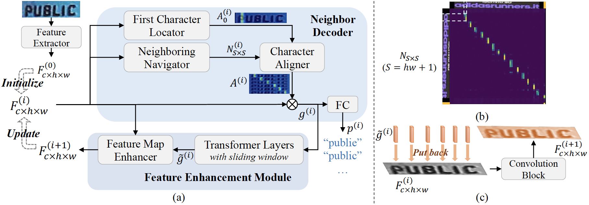
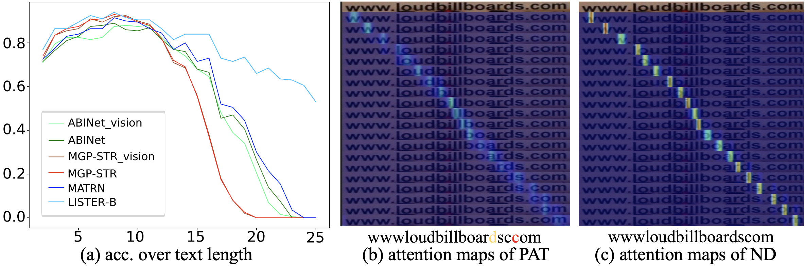

# LISTER: Neighbor Decoding for Length-Insensitive Scene Text Recognition
The official PyTorch implementation of LISTER (ICCV 2023).

## Paper
- [ICCV2023]()
- [arXiv](https://arxiv.org/abs/2308.12774)

LISTER is the first work to achieve effective length-insensitive scene text recognition.
As the core component, the Neighbor Decoder (ND) is able to obtain accurate character attention maps with the assistance of a novel neighbor matrix regardless of the text lengths.
The Feature Enhancement Module (FEM) models the long-range dependency with low computation cost, and is also able to perform iterations with ND to enhance the feature map progressively.
Extensive experiments demonstrate that LISTER exhibits obvious superiority on long text recognition and the ability for length extrapolation, while comparing favourably with the previous state-of-the-art methods on standard benchmarks for STR (mainly short text).


<center style="font-size:12px;color:#C0C0C0;text-decoration:underline">Fig.1. An overview of LISTER</center> 


<center style="font-size:12px;color:#C0C0C0;text-decoration:underline">Fig.2. Result visualization</center> 

## Environment
This work was conducted with PyTorch 1.12.1, CUDA 11.3, python 3.9.
```
pip install -r requirements.txt
```

## Dataset
The synthetic training set (MJ, ST) organized by [Fang et al.](https://github.com/FangShancheng/ABINet#datasets) was used for training.

The 6 common benchmarks can be found from either [Fang et al.](https://github.com/FangShancheng/ABINet#datasets) or [Bautista et al.](https://github.com/baudm/parseq#datasets).
We suggest readers refer to [**Bautista et al.**](https://github.com/baudm/parseq#datasets) since they have prepared much more datasets for STR kindly.

### TUL
To evaluate length-insensitive text recognition better, we collected a new scene text dataset, named **Text of Uniformly-distributed Lengths** (TUL), where text of lengths 2-25 distributes uniformly, with 200 images and 200 different words for each length.
To be clear, we only consider 36 characters here, including 26 English letters and 10 digits.
The images are randomly sampled from the [competition dataset](https://rrc.cvc.uab.es/?ch=19&com=introduction).
Images with very poor quality are filtered.

We suggest that models evaluated on TUL should not be trained on real training set ([Bautista et al.](https://github.com/baudm/parseq#datasets)), since there may be some overlaps between the real training data and TUL.

TUL can be downloaded [here](https://www.modelscope.cn/datasets/damo/TUL/summary).

## Model Checkpoints
[LISTER-B](https://github.com/AlibabaResearch/AdvancedLiterateMachinery/releases/download/v1.4.0-LISTER-release/lister_base.tar.gz) | [LISTER-T](https://github.com/AlibabaResearch/AdvancedLiterateMachinery/releases/download/v1.4.0-LISTER-release/lister_tiny.tar.gz)

We found the attention scaling (`model/nb_decoder.py:192,202`) is important for the convergence of LISTER-B, but harmful to LISTER-T. Hence, it was removed in LISTER-T.

## Results
- Common Benchmarks (CoB)

| Test set   |   IIIT5k |   IC13_857 |   SVT |   IC15_1811 |   SVTP |   CUTE80 |   avg. |
|:-----------|---------:|-----------:|------:|------------:|-------:|---------:|-------:|
| LISTER-B   |     97.2 |       97.9 |  94.7 |        87.1 |   89.9 |     89.6 |   93.6 |
| LISTER-T   |     96.9 |       97.5 |  94.3 |        86.8 |   88.2 |     87.2 |   93.1 |

- More challenging datasets

| Test set   |   ArT |   COCOv1.4 |   Uber |   avg. |
|:-----------|------:|-----------:|-------:|-------:|
| LISTER-B   |  70.1 |       65.8 |   49.0 |   56.2 |
| LISTER-T   |  69.0 |       64.2 |   48.0 |   55.1 |

- TUL

| Model      | Acc. |
|:-----------|-----:|
| LISTER-T   | 77.2 |
| LISTER-B   | 79.2 |

## Training
Firstly, modify the data path variables in `config/lister.yml`.

- One GPU

One Nvidia A100 80GB is enough to train.

```
CUDA_VISIBLE_DEVICES=0 python train.py -c=config/lister.yml [--model_name=lister_base] [--enc_version=base] [--iters=2] [--num_sa_layers=1] [--num_mg_layers=1] [--max_len=32]
```
```
CUDA_VISIBLE_DEVICES=0 python train.py -c=config/lister.yml --model_name=lister_tiny --enc_version=tiny
```
`model_name` is used to distinguish different experiments.
`enc_version` is the version of the feature extractor.
`iters` is the number of iterations of FEM. If you do not plan to use FEM, just set `--iters=0`.
`max_len` should be set to a proper value if your GPU memory is not enough to run.

For more infomation about the hyper-parameters, please refer to `config/lister.yml`.

- Multiple GPUs
One Nvidia V100 32GB cannot hold the batch size 512.

Take 2 GPUs as an example:
```
torchrun --nproc_per_node=2 --nnodes=1 --master_port=1354 train_dist.py -c=config/lister.yml [--model_name=lister_base_dist] [--batch_size=256] [--max_len=30]
```

However, we found our implementation of distributed training is a little bit inferior to the single-card training (about 0.4% drop).
Suggestions will be appreciated if some bug or improvement is raised in the issues.

## Testing
- LISTER-B
```
CUDA_VISIBLE_DEVICES=0 python test.py -c=config/lister.yml --model_name=lister_base [--enc_version=base] [--iters=2] [--num_sa_layers=1] [--num_mg_layers=1]
```

### To use the multi-scale ensemble strategy
Here is the way to use the ensemble strategy for Common Benchmarks or TUL.

In the method `resize` of class `ImageDataset` in `dataset/dataset.py`, 3 scaling options are provided (2 are commented).
You should run the following command 3 times when the 3 options work repectively (by uncomment 1 and comment 1).
After each running, you should rename the result file name.
```
CUDA_VISIBLE_DEVICES=0 python test.py -c=config/lister.yml --model_name=lister_base --ret_probs=True
```
Next, you should check the file `multi_size_ensemble.py`. Modify the variables `nums` and `res_fn_candidates` as you need. Then run:
```
python multi_size_ensemble.py
```

### To evaluate the accuracy over text length
You should get the result file on TUL first, then run:
```
python eval_len_bias.py data/ocr_res_on_TUL.txt
```

### Model cost
```
python model_cost.py -c=config/lister.yml
```

## Some details
- It will be not able to converge if the softmax operation is placed after the weighted average on `nb_map` in `model/nb_decoder.py`.
- LayerNorm is essential in Feature Map Enhancer. Without it, loss cannot converge.

## Acknowledgments
We would like to thank [ABINet](https://github.com/FangShancheng/ABINet) and [PARSeq](https://github.com/baudm/parseq) for their careful arrangement of STR datasets and code of data augmentation.

Besides, we refered to [FocalNet](https://github.com/microsoft/FocalNet) for building our feature extractor.

## Citation
Please cite our paper if the work helps you.
```
@article{iccv2023lister,
  title={LISTER:  Neighbor Decoding for Length-Insensitive Scene Text Recognition},
  author={Changxu Cheng and Peng Wang and Cheng Da and Qi Zheng and Cong Yao},
  journal={2023 IEEE/CVF International Conference on Computer Vision (ICCV)},
  year={2023}
}
```

## License
```
Copyright 2023-present Alibaba Group.

Licensed under the Apache License, Version 2.0 (the "License");
you may not use this file except in compliance with the License.
You may obtain a copy of the License at

    http://www.apache.org/licenses/LICENSE-2.0

Unless required by applicable law or agreed to in writing, software
distributed under the License is distributed on an "AS IS" BASIS,
WITHOUT WARRANTIES OR CONDITIONS OF ANY KIND, either express or implied.
See the License for the specific language governing permissions and
limitations under the License.
```
