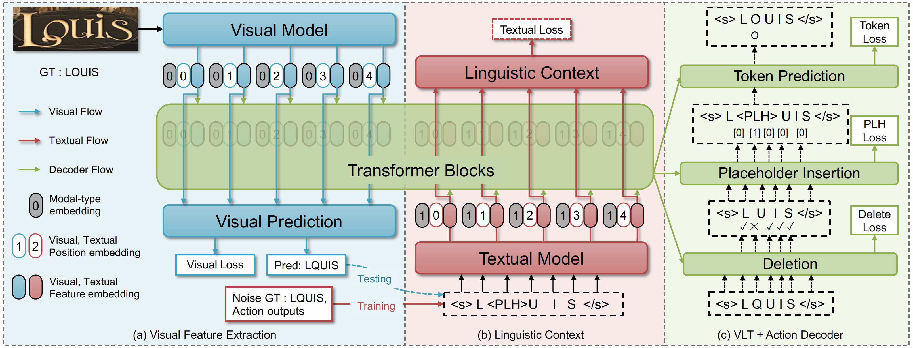
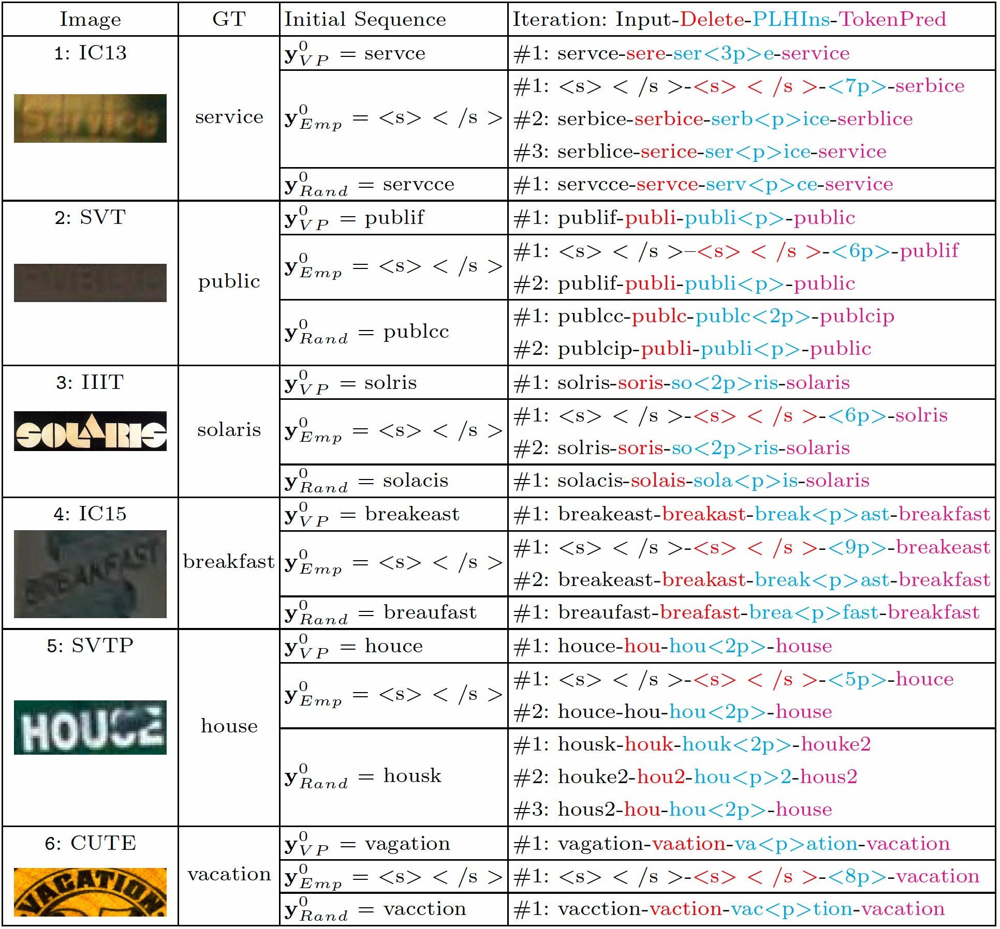

# Levenshtein OCR

The official PyTorch implementation of LevOCR (ECCV 2022).

LevOCR can perform text sequence generation task and text sequence refinement task with the cross-modal fusion feature generated by Vision-Language Transformer (VLT) model. The refinement process is accomplished via two basic character-level operations: **Deletion** and **Insertion**, which are learned with **Imitation Learning** and allow for parallel decoding, dynamic length change and good interpretability. LevOCR exhibits the good interpretability and transparency in the inference phase, which could be very crucial for diagnosing and improving text recognition models in the future.

### Paper
* [ECCV 2022](https://link.springer.com/chapter/10.1007/978-3-031-19815-1_19)
* [Arxiv](https://arxiv.org/abs/2209.03594)




### Install requirements
* [PyTorch](http://pytorch.org/) version >= 1.8.0
* Python version >= 3.6

```
pip3 install -r requirements.txt
```

* For training new models, you need to install [fairseq](https://github.com/facebookresearch/fairseq)(We borrowed the parts of fairseq during training)
```
git clone https://github.com/pytorch/fairseq
cd fairseq
git checkout 0.12.2-release
pip install --editable ./
python setup.py build_ext --inplace

```

### Dataset

Download lmdb dataset from [Read Like Humans: Autonomous, Bidirectional and Iterative Language Modeling for Scene Text Recognition](https://github.com/FangShancheng/ABINet).

- Training datasets

    1. [MJSynth](http://www.robots.ox.ac.uk/~vgg/data/text/) (MJ): 
        - Use `tools/create_lmdb_dataset.py` to convert images into LMDB dataset
        - [LMDB dataset BaiduNetdisk(passwd:n23k)](https://pan.baidu.com/s/1mgnTiyoR8f6Cm655rFI4HQ)
    2. [SynthText](http://www.robots.ox.ac.uk/~vgg/data/scenetext/) (ST):
        - Use `tools/crop_by_word_bb.py` to crop images from original [SynthText](http://www.robots.ox.ac.uk/~vgg/data/scenetext/) dataset, and convert images into LMDB dataset by `tools/create_lmdb_dataset.py`
        - [LMDB dataset BaiduNetdisk(passwd:n23k)](https://pan.baidu.com/s/1mgnTiyoR8f6Cm655rFI4HQ)
    3. [Train_language](https://github.com/AlibabaResearch/AdvancedLiterateMachinery/releases/download/v1.0.3-LevOCR-model/train_language.txt):
        - This text dataset is only used for the pre-trainig of the language model.
        - It contains words from [WikiText103](https://s3.amazonaws.com/research.metamind.io/wikitext/wikitext-103-v1.zip), MJSynth and SynthText.

- Evaluation datasets
  LMDB datasets can be downloaded from [BaiduNetdisk(passwd:1dbv)](https://pan.baidu.com/s/1RUg3Akwp7n8kZYJ55rU5LQ), [GoogleDrive](https://drive.google.com/file/d/1dTI0ipu14Q1uuK4s4z32DqbqF3dJPdkk/view?usp=sharing).<br>
    1. ICDAR 2013 (IC13)
    2. ICDAR 2015 (IC15)
    3. IIIT5K Words (IIIT)
    4. Street View Text (SVT)
    5. Street View Text-Perspective (SVTP)
    6. CUTE80 (CUTE)

- The structure of data folder as below.
```
data
├── evaluation
│   ├── CUTE80
│   ├── IC13_857
│   ├── IC15_1811
│   ├── IIIT5k_3000
│   ├── SVT
│   └── SVTP
├── training
│   ├── MJ
│   │   ├── MJ_test
│   │   ├── MJ_train
│   │   └── MJ_valid
│   ├── ST
│   └── train_language.txt
```
At this time, training datasets and evaluation datasets are LMDB datasets <br>


### Pretrained Models 

Available model weights:

| Language | Vision  | LevOCR |
| :---: | :---: | :---: |
|[Pretrain-language-model](https://github.com/AlibabaResearch/AdvancedLiterateMachinery/releases/download/v1.0.3-LevOCR-model/pretrain-language-model.pth)|[Pretrain-vision-model](https://github.com/AlibabaResearch/AdvancedLiterateMachinery/releases/download/v1.0.3-LevOCR-model/pretrain-vision-model.pth)|[LevOCR-model](https://github.com/AlibabaResearch/AdvancedLiterateMachinery/releases/download/v1.0.3-LevOCR-model/levocr_model.pth)|


### Benchmarks (Top 1% accuracy)

Performances of the reproduced pretrained models are summaried as follows:

<table><tbody>
    <tr>
        <th>&nbsp;&nbsp;Model&nbsp;&nbsp;</th>
        <th>&nbsp;&nbsp;Iteration&nbsp;&nbsp;</th>
        <th>&nbsp;&nbsp;IC13&nbsp;&nbsp;</th>
        <th>&nbsp;&nbsp;SVT&nbsp;&nbsp;</th>
        <th>&nbsp;&nbsp;IIIT&nbsp;&nbsp;</th>
        <th>&nbsp;&nbsp;IC15&nbsp;&nbsp;</th>
        <th>&nbsp;&nbsp;SVTP&nbsp;&nbsp;</th>
        <th>&nbsp;&nbsp;CUTE&nbsp;&nbsp;</th>
        <th>&nbsp;&nbsp;AVG&nbsp;&nbsp;</th>
    </tr>
    <tr>
        <td rowspan="1" align="center">LevOCR-VP</td>
        <td align="center">-</td>
        <td align="center">95.8</td>
        <td align="center">92.4</td>
        <td align="center">95.4</td>
        <td align="center">84.5</td>
        <td align="center">84.6</td>
        <td align="center">88.8</td>
        <td align="center">91.2</td>
    </tr>
    <tr>
        <td rowspan="3" align="center">LevOCR</td>
        <td align="center">#1</td>
        <td align="center">96.7</td>
        <td align="center">94.2</td>
        <td align="center">96.5</td>
        <td align="center">86.1</td>
        <td align="center">88.6</td>
        <td align="center">90.6</td>
        <td align="center">92.8</td>
    </tr>
    <tr>
        <td align="center">#2</td>
        <td align="center">96.7</td>
        <td align="center">94.4</td>
        <td align="center">96.6</td>
        <td align="center">86.5</td>
        <td align="center">88.8</td>
        <td align="center">90.6</td>
        <td align="center">92.9</td>
    </tr>
    <tr>
        <td align="center">#3</td>
        <td align="center">96.7</td>
        <td align="center">94.4</td>
        <td align="center">96.6</td>
        <td align="center">86.5</td>
        <td align="center">88.8</td>
        <td align="center">90.6</td>
        <td align="center">92.9</td>
    </tr>
</table>


### Run demo with pretrained model
1. Download pretrained model 
2. Add image files to test into `demo_imgs/`
3. Run demo_imgs.py
```
python3 demo_imgs.py  --imgH 32 --imgW 128  --max_iter 2 --batch_size 16 --model_dir <path_to/model.pth> --rgb --th 0.5 --demo_imgs demo_imgs 
```

### Train

1. Pre-train language model

```
CUDA_VISIBLE_DEVICES=0,1,2,3 python3 -m torch.distributed.launch --nproc_per_node=4 --nnodes=1 --master_port 29501  train_language_dist.py --train_data data/training/train_language.txt \
--valInterval 5000 --lr 0.3 --saved_path <path/to/save/dir> --exp_name levocr_pretrain_language --batch_size 512 --num_iter 2400000 
```

2. Train LevOCR

```
CUDA_VISIBLE_DEVICES=0,1,2,3 python3 -m torch.distributed.launch --nproc_per_node=4 --nnodes=1 --master_port 29501 train_final_dist.py --train_data data/training \ 
--valid_data data/evaluation --select_data MJ-ST --batch_ratio 0.5-0.5  --valInterval 5000 --lr 0.3 --rgb  \
--saved_path <path/to/save/dir> --exp_name levocr_32_128 --batch_size 32 --manualSeed 21223 --seed 223 --num_iter 2400000 \
--vis_model <path/to/pretrain-vision-model.pth> --levt_model <path/to/pretrain-language-model.pth>
```


### Test

Find the path to `best_accuracy.pth` checkpoint file (usually in `saved_path` folder).

```
python3 eval.py  --eval_data data/evaluation --data_filtering_off --fast_acc --imgH 32 --imgW 128 --batch_size 128 --rgb --th 0.5 --max_iter 2 --model_dir <path_to/best_accuracy.pth>
```

## Iterative Process
The detailed iterative process of LevOCR with different initial sequences on 6 public benchmarks.




## Acknowledgements
This implementation has been based on these repository [fairseq](https://github.com/facebookresearch/fairseq), [CLOVA AI Deep Text Recognition Benchmark](https://github.com/clovaai/deep-text-recognition-benchmark), [ABINet](https://github.com/FangShancheng/ABINet).


## Citation
If you find this work useful, please cite:

```
@inproceedings{ECCV2022LevOCR,
  title={Levenshtein OCR},
  author={Cheng Da, Peng Wang, and Cong Yao},
  booktitle = {ECCV},
  year={2022}
}
```

## *License*

LevOCR is released under the terms of the [Apache License, Version 2.0](LICENSE).

```
LevOCR is an algorithm for scene text recognition and the code and models herein created by the authors from Alibaba can only be used for research purpose.
Copyright (C) 1999-2022 Alibaba Group Holding Ltd. 

Licensed under the Apache License, Version 2.0 (the "License");
you may not use this file except in compliance with the License.
You may obtain a copy of the License at

    http://www.apache.org/licenses/LICENSE-2.0

Unless required by applicable law or agreed to in writing, software
distributed under the License is distributed on an "AS IS" BASIS,
WITHOUT WARRANTIES OR CONDITIONS OF ANY KIND, either express or implied.
See the License for the specific language governing permissions and
limitations under the License.
```