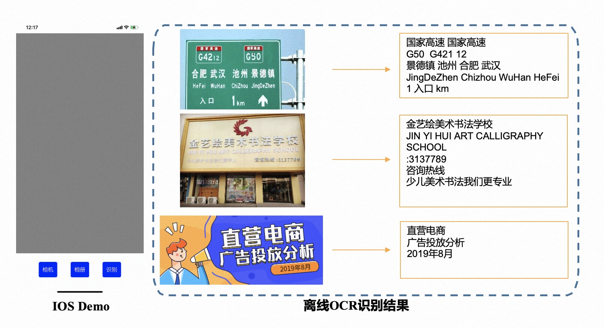
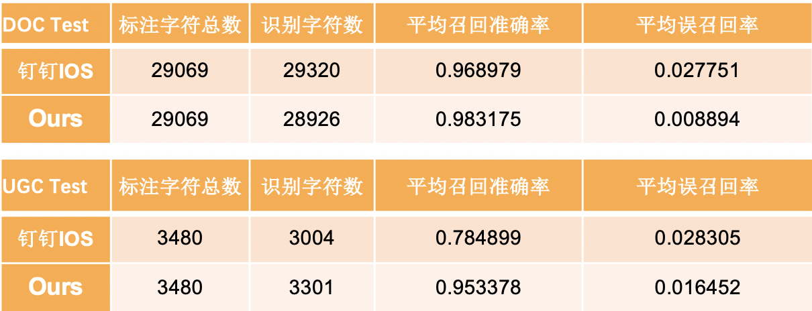

# Introduction
LightWeight OCR is committed to providing efficient OCR models with small parameters and high precision, which can be deployed offline on Mobile terminals or IOT devices. We provide open source models which can be finetuned with your own data. In addition, we provide demos deployed on multiple platforms, you can replace the old models with your own trained models for testing and depolying.

# Open Source Models
We use techniques such as neural network architecture search, reparameterization, and distillation to compress the models. We use DB for the ocr detection task and CRNN for the ocr recognition task. We open the base models on ModelScope, the download link is below.

 [lightweight_ocr-detection-general_damo](https://modelscope.cn/models/damo/cv_proxylessnas_ocr-detection-db-line-level_damo/summary)

 [lightweight_ocr-recognitoin-general_damo](https://modelscope.cn/models/damo/cv_LightweightEdge_ocr-recognitoin-general_damo/summary)


# Platform
## IOS
We provide a simple ios demo in DuGuang_LiteOCR_IOS_DEMO, which can take pictures or import pictures from the album for offline OCR recognition. We run this demo on IOS 14.2 and xCode 12.3. You can download this demo code and compile it on your own iPhone to test the results.



We provide 30 doc test images and 30 ugc test images. An end-to-end comparison with the "Recognize Text in Pictures" function in the DingTalk IOS application internally uses Apple's offline Mobile OCR capability. The specific comparison results are as follows:




# Train/Test Your Own Model
1.Use your own data to perform finetune on the modelscope according to the corresponding instructions

2.Convert the pth models to the [MNN](https://www.mnn.zone/m/0.3/index.html) models

3.Replace the converted MNN models with the models in folder "LightWeight_Mobile_Model/"

4.Rebulid the Demo and then Test

# License
``` 
Lightweight OCR is released under the terms of the Apache License, Version 2.0.

Lightweight OCR is an lightweight OCR project and the code and models herein created by the authors from Alibaba can only be used for research purpose.
Copyright (C) 1999-2022 Alibaba Group Holding Ltd. 

Licensed under the Apache License, Version 2.0 (the "License");
you may not use this file except in compliance with the License.
You may obtain a copy of the License at

    http://www.apache.org/licenses/LICENSE-2.0

Unless required by applicable law or agreed to in writing, software
distributed under the License is distributed on an "AS IS" BASIS,
WITHOUT WARRANTIES OR CONDITIONS OF ANY KIND, either express or implied.
See the License for the specific language governing permissions and
limitations under the License.
``` 
