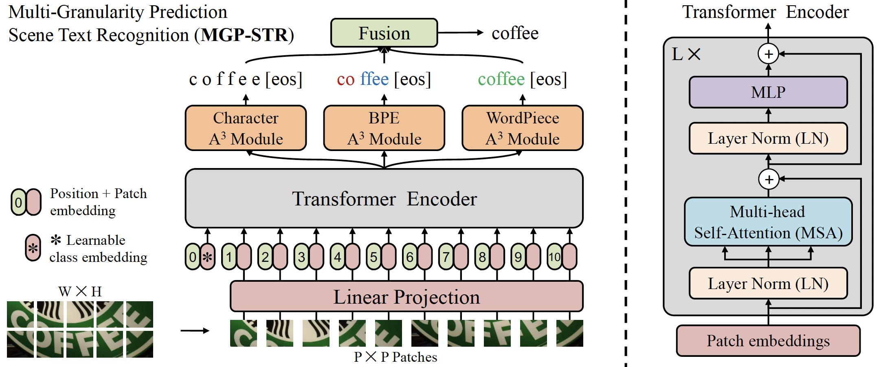
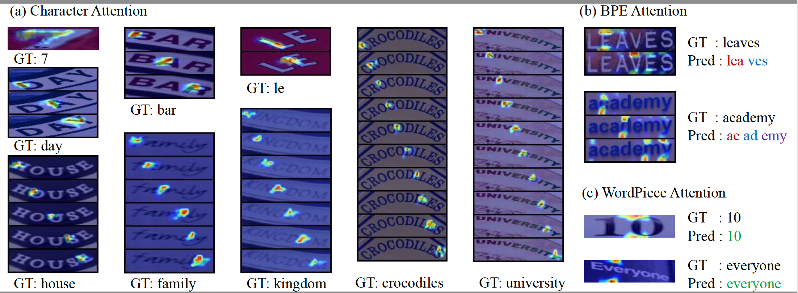

# Multi-Granularity Prediction for Scene Text Recognition

The official PyTorch implementation of MGP-STR (ECCV 2022).

MGP-STR is a conceptually **SIMPLE** yet **POWERFUL** vision STR model, which is built upon Vision Transformer (ViT). To integrate linguistic knowledge, Multi-Granularity Prediction (MGP) strategy is proposed to inject information from the language modality into
the model in an implicit way. With **NO** independent language model (LM), MGP-STR outperforms previous state-of-the-art models for scene text recognition, including both pure vision models and language-augmented methods. <br>


### Paper
* [ECCV 2022](https://www.ecva.net/papers/eccv_2022/papers_ECCV/papers/136880336.pdf)
* [Arxiv](https://arxiv.org/abs/2209.03592)



<!--  -->

### Install requirements
- This work was tested with PyTorch 1.7.0, CUDA 10.1, python 3.6 and Ubuntu 16.04. <br>

```
pip3 install -r requirements.txt
```

### Dataset

Download lmdb dataset from [Read Like Humans: Autonomous, Bidirectional and Iterative Language Modeling for Scene Text Recognition](https://github.com/FangShancheng/ABINet).

- Training datasets

    1. [MJSynth](http://www.robots.ox.ac.uk/~vgg/data/text/) (MJ): 
        - Use `tools/create_lmdb_dataset.py` to convert images into LMDB dataset
        - [LMDB dataset BaiduNetdisk(passwd:n23k)](https://pan.baidu.com/s/1mgnTiyoR8f6Cm655rFI4HQ)
    2. [SynthText](http://www.robots.ox.ac.uk/~vgg/data/scenetext/) (ST):
        - Use `tools/crop_by_word_bb.py` to crop images from original [SynthText](http://www.robots.ox.ac.uk/~vgg/data/scenetext/) dataset, and convert images into LMDB dataset by `tools/create_lmdb_dataset.py`
        - [LMDB dataset BaiduNetdisk(passwd:n23k)](https://pan.baidu.com/s/1mgnTiyoR8f6Cm655rFI4HQ)
    3. [Real](https://github.com/baudm/parseq/blob/main/Datasets.md):
        - We use the real dataset from [PARSeq](https://github.com/baudm/parseq). We recommend you follow the instructions of [PARSeq](https://github.com/baudm/parseq) at its [parseq/Datasets.md](https://github.com/baudm/parseq/blob/main/Datasets.md) . The gdrive links are [gdrive-link1](https://drive.google.com/drive/folders/1NYuoi7dfJVgo-zUJogh8UQZgIMpLviOE) and [gdrive-link2](https://drive.google.com/drive/folders/1D9z_YJVa6f-O0juni-yG5jcwnhvYw-qC) from PARSeq.
    4. [Union14M-L](https://github.com/Mountchicken/Union14M/):
        - We use [Union14M-L](https://github.com/Mountchicken/Union14M/) for training, you can download from [here](https://github.com/Mountchicken/Union14M#34-download).
    


- Evaluation datasets
    Datasets can be downloaded from [BaiduNetdisk(passwd:1dbv)](https://pan.baidu.com/s/1RUg3Akwp7n8kZYJ55rU5LQ), [GoogleDrive](https://drive.google.com/file/d/1dTI0ipu14Q1uuK4s4z32DqbqF3dJPdkk/view?usp=sharing) and [parseq/Datasets.md](https://github.com/baudm/parseq/blob/main/Datasets.md) .<br>
    1. ICDAR 2013 (IC13_857)
    2. ICDAR 2013 (IC13_1015)
    3. ICDAR 2015 (IC15_1811)
    4. ICDAR 2015 (IC15_2077)
    5. IIIT5K Words (IIIT)
    6. Street View Text (SVT)
    7. Street View Text-Perspective (SVTP)
    8. CUTE80 (CUTE)
    9. ArT (ArT)
    10. COCOv1.4 (COCO)
    11. Uber (Uber)
    

- The structure of data folder as below.
```
data
├── evaluation
│   ├── CUTE80
│   ├── IC13_857
│   ├── IC13_1015
│   ├── IC15_1811
│   ├── IC15_2077
│   ├── IIIT5k_3000
│   ├── SVT
│   ├── SVTP
│   ├── ArT
│   ├── COCOv1.4
│   └── Uber
├── training
│   ├── MJ
│   │   ├── MJ_test
│   │   ├── MJ_train
│   │   └── MJ_valid
│   ├── Real
│   └── Union14M-L
```
At this time, training datasets and evaluation datasets are LMDB datasets <br>

### Trained on MJ+ST data

Available model weights:

| Tiny | Small  | Base |
| :---: | :---: | :---: |
|[MGP-STR-Tiny](https://github.com/AlibabaResearch/AdvancedLiterateMachinery/releases/download/V1.0.1-ECCV2022-model/mgp_str_tiny_patch4_32_128.pth)|[MGP-STR-Small](https://github.com/AlibabaResearch/AdvancedLiterateMachinery/releases/download/V1.0.1-ECCV2022-model/mgp_str_small_patch4_32_128.pth)|[MGP-STR-Base](https://github.com/AlibabaResearch/AdvancedLiterateMachinery/releases/download/V1.0.1-ECCV2022-model/mgp_str_base_patch4_32_128.pth)|

Performances of the reproduced pretrained models are summaried as follows:

<table><tbody>
    <tr>
        <th>&nbsp;&nbsp;Model&nbsp;&nbsp;</th>
        <th>&nbsp;&nbsp;Output&nbsp;&nbsp;</th>
        <th>&nbsp;&nbsp;IC13_857&nbsp;&nbsp;</th>
        <th>&nbsp;&nbsp;SVT&nbsp;&nbsp;</th>
        <th>&nbsp;&nbsp;IIIT&nbsp;&nbsp;</th>
        <th>&nbsp;&nbsp;IC15_1811&nbsp;&nbsp;</th>
        <th>&nbsp;&nbsp;SVTP&nbsp;&nbsp;</th>
        <th>&nbsp;&nbsp;CUTE&nbsp;&nbsp;</th>
        <th>&nbsp;&nbsp;AVG&nbsp;&nbsp;</th>
    </tr>
    <tr>
        <td rowspan="4" align="center">MGP-STR-tiny</td>
        <td align="center">Char</td>
        <td align="center">94.6</td>
        <td align="center">91.2</td>
        <td align="center">94.1</td>
        <td align="center">82.7</td>
        <td align="center">84.7</td>
        <td align="center">81.9</td>
        <td align="center">89.7</td>
    </tr>
    <tr>
        <td align="center">BPE</td>
        <td align="center">86.3</td>
        <td align="center">86.4</td>
        <td align="center">83.6</td>
        <td align="center">73.2</td>
        <td align="center">80.0</td>
        <td align="center">70.1</td>
        <td align="center">80.7</td>
    </tr>
    <tr>
        <td align="center">WP</td>
        <td align="center">53.7</td>
        <td align="center">43.1</td>
        <td align="center">56.8</td>
        <td align="center">52.0</td>
        <td align="center">39.2</td>
        <td align="center">44.1</td>
        <td align="center">51.9</td>
    </tr>
    <tr>
        <td align="center">Fuse</td>
        <td align="center">95.3</td>
        <td align="center">92.1</td>
        <td align="center">94.3</td>
        <td align="center">83.1</td>
        <td align="center">85.9</td>
        <td align="center">81.6</td>
        <td align="center">90.2</td>
    </tr>
    <tr>
        <td rowspan="4" align="center">MGP-STR-small</td>
        <td align="center">Char</td>
        <td align="center">95.8</td>
        <td align="center">91.8</td>
        <td align="center">95.0</td>
        <td align="center">84.9</td>
        <td align="center">86.7</td>
        <td align="center">87.5</td>
        <td align="center">91.2</td>
    </tr>
    <tr>
        <td align="center">BPE</td>
        <td align="center">97.0</td>
        <td align="center">94.0</td>
        <td align="center">88.8</td>
        <td align="center">80.5</td>
        <td align="center">87.4</td>
        <td align="center">84.0</td>
        <td align="center">87.8</td>
    </tr>
    <tr>
        <td align="center">WP</td>
        <td align="center">79.5</td>
        <td align="center">76.4</td>
        <td align="center">77.0</td>
        <td align="center">70.2</td>
        <td align="center">72.7</td>
        <td align="center">64.9</td>
        <td align="center">74.7</td>
    </tr>
    <tr>
        <td align="center">Fuse</td>
        <td align="center">96.6</td>
        <td align="center">93.2</td>
        <td align="center">95.1</td>
        <td align="center">86.4</td>
        <td align="center">88.1</td>
        <td align="center">88.5</td>
        <td align="center">92.0</td>
    </tr>
        <tr>
        <td rowspan="4" align="center">MGP-STR-base</td>
        <td align="center">Char</td>
        <td align="center">96.3</td>
        <td align="center">93.0</td>
        <td align="center">95.9</td>
        <td align="center">86.0</td>
        <td align="center">87.4</td>
        <td align="center">88.5</td>
        <td align="center">92.2</td>
    </tr>
    <tr>
        <td align="center">BPE</td>
        <td align="center">97.1</td>
        <td align="center">95.1</td>
        <td align="center">90.0</td>
        <td align="center">82.1</td>
        <td align="center">89.9</td>
        <td align="center">84.0</td>
        <td align="center">89.1</td>
    </tr>
    <tr>
        <td align="center">WP</td>
        <td align="center">97.8</td>
        <td align="center">94.6</td>
        <td align="center">89.1</td>
        <td align="center">81.6</td>
        <td align="center">90.4</td>
        <td align="center">81.6</td>
        <td align="center">88.6</td>
    </tr>
    <tr>
        <td align="center">Fuse</td>
        <td align="center">97.6</td>
        <td align="center">94.9</td>
        <td align="center">96.2</td>
        <td align="center">87.9</td>
        <td align="center">90.2</td>
        <td align="center">89.2</td>
        <td align="center">93.4</td>
    </tr>
</table>


### Trained on MJ+ST+Real+Union14M-L data

Available model weights:

| Base | Large  |
| :---: | :---: |
|[MGP-STR-Base](https://github.com/AlibabaResearch/AdvancedLiterateMachinery/releases/download/V1.0.1-ECCV2022-model/mgp_str_base_union14.pth)|[MGP-STR-Large](https://github.com/AlibabaResearch/AdvancedLiterateMachinery/releases/download/V1.0.1-ECCV2022-model/mgp_str_large_union14.py)|

Performances of the reproduced pretrained models are summaried as follows:

<table><tbody>
    <tr>
        <th>&nbsp;&nbsp;Model&nbsp;&nbsp;</th>
        <th>&nbsp;&nbsp;Output&nbsp;&nbsp;</th>
        <th>&nbsp;&nbsp;IIIT&nbsp;&nbsp;</th>
        <th>&nbsp;&nbsp;SVT&nbsp;&nbsp;</th>
        <th>&nbsp;&nbsp;IC13_1015&nbsp;&nbsp;</th>
        <th>&nbsp;&nbsp;IC15_2077&nbsp;&nbsp;</th>
        <th>&nbsp;&nbsp;SVTP&nbsp;&nbsp;</th>
        <th>&nbsp;&nbsp;CUTE&nbsp;&nbsp;</th>
        <th>&nbsp;&nbsp;ArT&nbsp;&nbsp;</th>
        <th>&nbsp;&nbsp;COCO&nbsp;&nbsp;</th>
        <th>&nbsp;&nbsp;Uber&nbsp;&nbsp;</th>
    </tr>
    <tr>
        <td rowspan="4" align="center">MGP-STR-base</td>
        <td align="center">Char</td>
        <td align="center">98.4</td>
        <td align="center">98.0</td>
        <td align="center">98.2</td>
        <td align="center">89.3</td>
        <td align="center">96.7</td>
        <td align="center">98.6</td>
        <td align="center">84.5</td>
        <td align="center">78.8</td>
        <td align="center">87.9</td>
    </tr>
    <tr>
        <td align="center">BPE</td>
        <td align="center">96.6</td>
        <td align="center">97.5</td>
        <td align="center">98.0</td>
        <td align="center">88.0</td>
        <td align="center">96.1</td>
        <td align="center">96.8</td>
        <td align="center">80.7</td>
        <td align="center">76.6</td>
        <td align="center">88.0</td>
    </tr>
    <tr>
        <td align="center">WP</td>
        <td align="center">96.5</td>
        <td align="center">97.2</td>
        <td align="center">98.3</td>
        <td align="center">88.1</td>
        <td align="center">95.3</td>
        <td align="center">96.8</td>
        <td align="center">80.9</td>
        <td align="center">76.1</td>
        <td align="center">87.8</td>
    </tr>
    <tr>
        <td align="center">Fuse</td>
        <td align="center">98.5</td>
        <td align="center">98.5</td>
        <td align="center">98.6</td>
        <td align="center">89.9</td>
        <td align="center">97.2</td>
        <td align="center">98.3</td>
        <td align="center">84.5</td>
        <td align="center">79.9</td>
        <td align="center">89.6</td>
    </tr>
    <tr>
        <td rowspan="4" align="center">MGP-STR-large</td>
        <td align="center">Char</td>
        <td align="center">98.7</td>
        <td align="center">98.7</td>
        <td align="center">97.9</td>
        <td align="center">90.6</td>
        <td align="center">97.8</td>
        <td align="center">98.9</td>
        <td align="center">85.4</td>
        <td align="center">80.6</td>
        <td align="center">89.4</td>
    </tr>
    <tr>
        <td align="center">BPE</td>
        <td align="center">97.2</td>
        <td align="center">97.5</td>
        <td align="center">97.9</td>
        <td align="center">89.4</td>
        <td align="center">97.6</td>
        <td align="center">97.5</td>
        <td align="center">82.7</td>
        <td align="center">78.4</td>
        <td align="center">89.9</td>
    </tr>
    <tr>
        <td align="center">WP</td>
        <td align="center">97.3</td>
        <td align="center">98.1</td>
        <td align="center">97.8</td>
        <td align="center">89.4</td>
        <td align="center">97.2</td>
        <td align="center">97.2</td>
        <td align="center">83.3</td>
        <td align="center">78.6</td>
        <td align="center">89.8</td>
    </tr>
    <tr>
        <td align="center">Fuse</td>
        <td align="center">98.8</td>
        <td align="center">98.6</td>
        <td align="center">98.5</td>
        <td align="center">90.8</td>
        <td align="center">98.3</td>
        <td align="center">99.3</td>
        <td align="center">85.5</td>
        <td align="center">81.7</td>
        <td align="center">91.0</td>
    </tr>
</table>

### Run demo with pretrained model
1. Download pretrained model 
2. Add image files to test into `demo_imgs/`
3. Run demo.py
```
mkdir demo_imgs/attens
CUDA_VISIBLE_DEVICES=0 python3 demo.py --Transformer mgp-str \
--TransformerModel=mgp_str_base_patch4_3_32_128 --model_dir mgp_str_base.pth --demo_imgs demo_imgs/
```


### Train

MGP-STR-base

```
CUDA_VISIBLE_DEVICES=0 python3 -m torch.distributed.launch --nproc_per_node=1 --nnodes=1 --master_port 29501 train_final_dist.py --train_data data/training \
--valid_data data/evaluation  --select_data MJ-ST  \
--batch_ratio 0.5-0.5  --Transformer mgp-str \
--TransformerModel=mgp_str_base_patch4_3_32_128 --imgH 32 --imgW 128 \
--manualSeed=226 --workers=12 --isrand_aug --scheduler --batch_size=100 --rgb \
--saved_path <path/to/save/dir> --exp_name mgp_str_patch4_3_32_128 --valInterval 5000 --num_iter 2000000 --lr 1
```

### Multi-GPU training

MGP-STR-base on a 2-GPU machine

It is recommended to train larger networks like MGP-STR-Small and MGP-STR-Base on a multi-GPU machine. To keep a fixed batch size at `100`, use the `--batch_size` option. Divide `100` by the number of GPUs. For example, to train MGP-STR-Small on a 2-GPU machine, this would be `--batch_size=50`.

```
CUDA_VISIBLE_DEVICES=0,1 python3 -m torch.distributed.launch --nproc_per_node=2 --nnodes=1 --master_port 29501 train_final_dist.py --train_data data/training \
--valid_data data/evaluation  --select_data MJ-ST  \
--batch_ratio 0.5-0.5  --Transformer mgp-str \
--TransformerModel=mgp_str_base_patch4_3_32_128 --imgH 32 --imgW 128 \
--manualSeed=226 --workers=12 --isrand_aug --scheduler --batch_size=50 --rgb \
--saved_path <path/to/save/dir> --exp_name mgp_str_patch4_3_32_128 --valInterval 5000 --num_iter 2000000 --lr 1
```


### Test

Find the path to `best_accuracy.pth` checkpoint file (usually in `saved_path` folder).

```
CUDA_VISIBLE_DEVICES=0 python3 test_final.py --eval_data data/evaluation --benchmark_all_eval --Transformer mgp-str  --data_filtering_off --rgb --fast_acc --TransformerModel=mgp_str_base_patch4_3_32_128 --model_dir <path_to/best_accuracy.pth>
```

## Visualization
The illustration of spatial attention masks on Character A3 module, BPE A3 module and WordPiece A3 module, respectively.




## Acknowledgements
This implementation has been based on these repository [ViTSTR](https://github.com/roatienza/deep-text-recognition-benchmark), [CLOVA AI Deep Text Recognition Benchmark](https://github.com/clovaai/deep-text-recognition-benchmark), [TokenLearner](https://github.com/google-research/scenic/tree/main/scenic/projects/token_learner).


## Citation
If you find this work useful, please cite:

```
@inproceedings{ECCV2022mgp_str,
  title={Multi-Granularity Prediction for Scene Text Recognition},
  author={Peng Wang, Cheng Da, and Cong Yao},
  booktitle = {ECCV},
  year={2022}
}
```

## *License*

MGP-STR is released under the terms of the [Apache License, Version 2.0](LICENSE).

```
MGP-STR is an algorithm for scene text recognition and the code and models herein created by the authors from Alibaba can only be used for research purpose.
Copyright (C) 1999-2022 Alibaba Group Holding Ltd. 

Licensed under the Apache License, Version 2.0 (the "License");
you may not use this file except in compliance with the License.
You may obtain a copy of the License at

    http://www.apache.org/licenses/LICENSE-2.0

Unless required by applicable law or agreed to in writing, software
distributed under the License is distributed on an "AS IS" BASIS,
WITHOUT WARRANTIES OR CONDITIONS OF ANY KIND, either express or implied.
See the License for the specific language governing permissions and
limitations under the License.
```