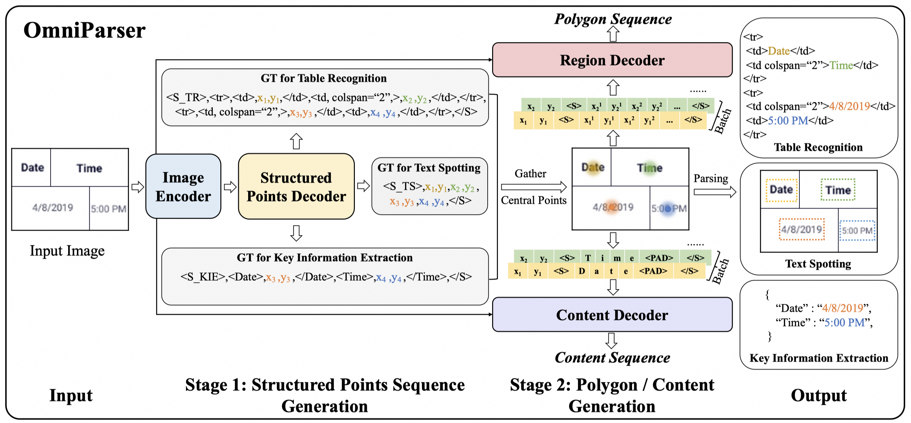
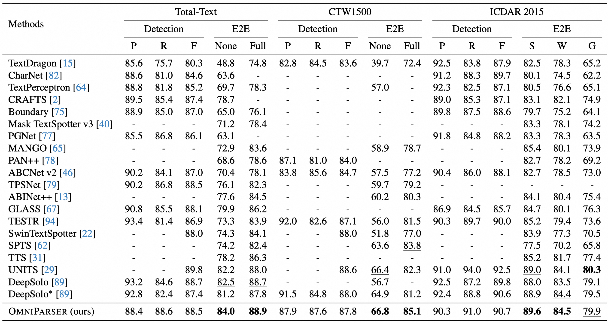

# OmniParser: A Unified Framework for Text Spotting, Key Information Extraction and Table Recognition

The official PyTorch implementation of OmniParser (CVPR 2024).

OmniParser stands as a unified framework that seamlessly combines three fundamental OCR tasks: text spotting, key information extraction, and table recognition. It employs a cohesive input & output schema based on the central points of text, facilitating integration. It ingeniously partitions the single textual representation into three components: structured center point sequence, polygonal sequence, and content sequence, effectively compressing the original lengthy sequence. Furthermore, this framework proposes the use of spatial and character-oriented window prompts, enhancing the understanding of text's spatial arrangement and word semantics. On standard benchmark datasets for these tasks, our approach has achieved state-of-the-art (SOTA) or competitive results, demonstrating the effectiveness and advancement of OmniParser.


### Paper
* [Arxiv](https://arxiv.org/abs/2403.19128)




### Install requirements
* [PyTorch](http://pytorch.org/) version >= 1.13.0
* Python version >= 3.8

```
pip install -r requirements.txt
```

### Dataset

Most datasets originate from [SPTS](https://github.com/shannanyinxiang/SPTS). Other datasets such as [COCO-Text](https://bgshih.github.io/cocotext/), [Open Images V5](https://storage.openvinotoolkit.org/repositories/openvino_training_extensions/datasets/open_images_v5_text), [CORD](https://github.com/clovaai/cord), [SROIE](https://rrc.cvc.uab.es/?ch=13&com=introduction), etc., need to be downloaded separately. The datasets can be organized in the following ways:

```bash
text_spotting_datasets
├── coco_text
│   ├── train2014
│   ├── cocotext.v2.json
├── cord
│   ├── data
│       ├── anns
│       ├── images 
├── CTW1500
│   ├── annotations
│   ├── ctwtest_text_image
│   ├── ctwtrain_text_image
├── syntext1
│   ├── syntext_word_eng
│   ├── train.json
├── syntext2
│   ├── emcs_imgs
│   ├── train.json
├── open_image_v5
│   ├── anns
│   ├    ├── text_spotting_openimages_v5_train_1.json
│   ├    ├── text_spotting_openimages_v5_train_2.json
│   ├         .
│   ├── data
│       ├── train_1
│       ├── train_2
│             .
│             .

              .
              .
```


### Training
1. Download the `swin_base_patch4_window7_224_22k.pth` from [Swin-Transformer](https://github.com/microsoft/Swin-Transformer) and put it in `pretrained_weights` folder.
2. Refer to `train.sh` for pretraining and finetuning.

### Benchmarks
Performances on three tasks as follows:

**Text Spotting task**



**KIE task**

| Methods                                   | Localization Ability | CORD F1 | CORD Acc | SROIE F1 | SROIE Acc |
|-------------------------------------------|----------------------|---------|-----------|-----------|------------|
| TRIE                | Yes                  | -       | -         | 82.1      | -          |
| Donut               | No                   | 84.1    | 90.9     | 83.2      | 92.8     |
| Dessurt             | No                   | 82.5    | -         | 84.9      | -          |
| DocParser    | No                   | 84.5  | -         | 87.3*     | -          |
| SeRum         | No                   | 80.5    | 85.8      | 85.6    | 92.8     |
| OmniParser                       | Yes                  | **84.8**  | 88.0    | 85.6   | **93.6**     |


**TR task**

PubTabNet (PTN)
| Methods                            | Input Size | Decoder Len. | S-TEDS | TEDS  |
|------------------------------------|------------|--------------|--------|-------|
| WYGIWYS      | 512        | -            | -      | 78.6  |
| Donut         | 1,280      | 4,000        | 25.28  | 22.7  |
| EDD                    | 512        | 1,800        | 89.9   | 88.3  |
| OmniParser                   | 1,024      | 1,500        | **90.45**  | **88.83** |

FinTabNet (FTN)

| Methods                            | Input Size | Decoder Len. | S-TEDS | TEDS  |
|------------------------------------|------------|--------------|--------|-------|
| Donut         | 1,280      | 4,000        | 30.66  | 29.1  |
| EDD                 | 512        | 1,800        | 90.6   | -     |
| OmniParser                   | 1,024      | 1,500        | **91.55**  | **89.75** |


## Notice
This implementation has been based on [SPTS](https://github.com/shannanyinxiang/SPTS). The code of (`dist.py, joiner.py, transforms.py, logger.py, main.py, vis_dataset.py, nested_tensor.py, frozen_bn.py, mlp.py, position_embedding.py`, etc.) introduced herein may not be used for commercial purposes, please refer to [SPTS](https://github.com/shannanyinxiang/SPTS).

## Citation
If you find this work useful, please cite:

```
@article{wan2024omniparser,
  title={OmniParser: A Unified Framework for Text Spotting, Key Information Extraction and Table Recognition},
  author={Wan, Jianqiang and Song, Sibo and Yu, Wenwen and Liu, Yuliang and Cheng, Wenqing and Huang, Fei and Bai, Xiang and Yao, Cong and Yang, Zhibo},
  journal={arXiv preprint arXiv:2403.19128},
  year={2024}
}
```

## *License*

OmniParser is released under the terms of the [Apache License, Version 2.0](LICENSE).

```
OmniParser is an algorithm for text spotting, key information extraction and table recognition, The code and models herein created by the authors from Alibaba can only be used for research purpose.
Copyright (C) 1999-2024 Alibaba Group Holding Ltd. 

Licensed under the Apache License, Version 2.0 (the "License");
you may not use this file except in compliance with the License.
You may obtain a copy of the License at

    http://www.apache.org/licenses/LICENSE-2.0

Unless required by applicable law or agreed to in writing, software
distributed under the License is distributed on an "AS IS" BASIS,
WITHOUT WARRANTIES OR CONDITIONS OF ANY KIND, either express or implied.
See the License for the specific language governing permissions and
limitations under the License.
```