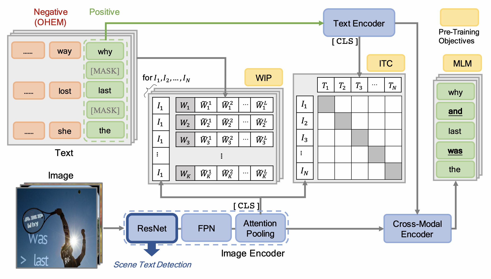

# Vision-Language Pre-Training for Boosting Scene Text Detectors

The official PyTorch implementation of VLPT-STD (CVPR 2022).

VLPT-STD is a new pre-training paradigm for scene text
detection that only requires text annotations. We propose three 
vision-language pretraining pretext tasks: imagetext contrastive learning (ITC), masked language modeling (MLM) and word-in-image prediction (WIP) to learn contextualized, joint representations, for the sake of enhancing the performance of scene text detectors. Extensive experiments on standard benchmarks demonstrate that the proposed paradigm can significantly improve the performance
of various representative text detectors.

### Paper
* [CVPR 2022](https://openaccess.thecvf.com/content/CVPR2022/papers/Song_Vision-Language_Pre-Training_for_Boosting_Scene_Text_Detectors_CVPR_2022_paper.pdf)
* [Arxiv](https://arxiv.org/pdf/2204.13867.pdf)




### Install requirements
* [PyTorch](http://pytorch.org/) version >= 1.8.0
* Python version >= 3.6
* [apex](https://github.com/NVIDIA/apex)

```
pip3 install -r requirements.txt
```

### Dataset

Download [synthtext dataset](https://www.robots.ox.ac.uk/~vgg/data/scenetext/).

- The structure of data folder as below.
```
data
└── SynthText
    ├── 1
    ├── 2
    ├── 3
    ├── ...
    └── gt.mat
```
- Use `write_synthtext_pyarrow.py` to prepare arrow data format 
for pretraining.

### Pretrained Models 
pretrained resnet50 at [this url]().

### Training 
```
CUDA_VISIBLE_DEVICES=0,1,2,3,4,5,6,7 python -m torch.distributed.launch -nproc_per_node=8 main.py --exp_name base
```


### Benchmarks
Performances on EAST, DB and PSENet are summaried as follows:
<table class="tg">
<thead>
  <tr>
    <th class="tg-c3ow"></th>
    <th class="tg-c3ow" colspan="3">ICDAR2015</th>
    <th class="tg-c3ow" colspan="3">ICDAR2017</th>
    <th class="tg-baqh" colspan="3">MSRA-TD500</th>
  </tr>
</thead>
<tbody>
  <tr>
    <td class="tg-baqh"></td>
    <td class="tg-baqh">P</td>
    <td class="tg-baqh">R</td>
    <td class="tg-baqh">F</td>
    <td class="tg-baqh">P</td>
    <td class="tg-baqh">R</td>
    <td class="tg-baqh">F</td>
    <td class="tg-baqh">P</td>
    <td class="tg-baqh">R</td>
    <td class="tg-baqh">F</td>
  </tr>
  <tr>
    <td class="tg-c3ow">EAST + SynthText</td>
    <td class="tg-c3ow">89.6</td>
    <td class="tg-c3ow">81.5</td>
    <td class="tg-c3ow">85.3</td>
    <td class="tg-c3ow">75.1</td>
    <td class="tg-baqh">61.9</td>
    <td class="tg-baqh">67.9</td>
    <td class="tg-baqh">86.9</td>
    <td class="tg-baqh">77.6</td>
    <td class="tg-baqh">82.0</td>
  </tr>
  <tr>
    <td class="tg-c3ow">EAST + VLPT-STD</td>
    <td class="tg-c3ow">91.5</td>
    <td class="tg-c3ow">85.4</td>
    <td class="tg-c3ow">88.3</td>
    <td class="tg-c3ow">77.7</td>
    <td class="tg-baqh">64.6</td>
    <td class="tg-baqh">70.5</td>
    <td class="tg-baqh">88.5</td>
    <td class="tg-baqh">76.7</td>
    <td class="tg-baqh">82.2</td>
  </tr>
</tbody>
</table>

<table class="tg">
<thead>
  <tr>
    <th class="tg-c3ow"></th>
    <th class="tg-c3ow" colspan="3">ICDAR2015</th>
    <th class="tg-c3ow" colspan="3">Total-Text</th>
    <th class="tg-baqh" colspan="3">MSRA-TD500</th>
  </tr>
</thead>
<tbody>
  <tr>
    <td class="tg-baqh"></td>
    <td class="tg-baqh">P</td>
    <td class="tg-baqh">R</td>
    <td class="tg-baqh">F</td>
    <td class="tg-baqh">P</td>
    <td class="tg-baqh">R</td>
    <td class="tg-baqh">F</td>
    <td class="tg-baqh">P</td>
    <td class="tg-baqh">R</td>
    <td class="tg-baqh">F</td>
  </tr>
  <tr>
    <td class="tg-c3ow">DB + SynthText</td>
    <td class="tg-c3ow">88.2</td>
    <td class="tg-c3ow">82.7</td>
    <td class="tg-c3ow">85.4</td>
    <td class="tg-c3ow">87.1</td>
    <td class="tg-baqh">82.5</td>
    <td class="tg-baqh">84.7</td>
    <td class="tg-baqh">91.5</td>
    <td class="tg-baqh">79.2</td>
    <td class="tg-baqh">84.9</td>
  </tr>
  <tr>
    <td class="tg-c3ow">DB + VLPT-STD</td>
    <td class="tg-c3ow">92.0</td>
    <td class="tg-c3ow">81.6</td>
    <td class="tg-c3ow">86.5</td>
    <td class="tg-c3ow">88.7</td>
    <td class="tg-baqh">84.0</td>
    <td class="tg-baqh">86.3</td>
    <td class="tg-baqh">92.3</td>
    <td class="tg-baqh">84.9</td>
    <td class="tg-baqh">88.5</td>
  </tr>
</tbody>
</table>

<table class="tg">
<thead>
  <tr>
    <th class="tg-c3ow"></th>
    <th class="tg-c3ow" colspan="3">ICDAR2015</th>
    <th class="tg-c3ow" colspan="3">Total-Text</th>
    <th class="tg-baqh" colspan="3">CTW1500</th>
  </tr>
</thead>
<tbody>
  <tr>
    <td class="tg-baqh"></td>
    <td class="tg-baqh">P</td>
    <td class="tg-baqh">R</td>
    <td class="tg-baqh">F</td>
    <td class="tg-baqh">P</td>
    <td class="tg-baqh">R</td>
    <td class="tg-baqh">F</td>
    <td class="tg-baqh">P</td>
    <td class="tg-baqh">R</td>
    <td class="tg-baqh">F</td>
  </tr>
  <tr>
    <td class="tg-c3ow">PSENet + SynthText</td>
    <td class="tg-c3ow">84.3</td>
    <td class="tg-c3ow">78.4</td>
    <td class="tg-c3ow">81.3</td>
    <td class="tg-c3ow">89.2</td>
    <td class="tg-baqh">79.2</td>
    <td class="tg-baqh">83.9</td>
    <td class="tg-baqh">83.6</td>
    <td class="tg-baqh">79.7</td>
    <td class="tg-baqh">81.6</td>
  </tr>
  <tr>
    <td class="tg-c3ow">PSENet + VLPT-STD</td>
    <td class="tg-c3ow">86.0</td>
    <td class="tg-c3ow">82.8</td>
    <td class="tg-c3ow">84.3</td>
    <td class="tg-c3ow">90.8</td>
    <td class="tg-baqh">82.0</td>
    <td class="tg-baqh">86.1</td>
    <td class="tg-baqh">86.3</td>
    <td class="tg-baqh">80.7</td>
    <td class="tg-baqh">83.3</td>
  </tr>
</tbody>
</table>

## Acknowledgements
This implementation has been based on [ViLT](https://github.com/dandelin/ViLT).


## Citation
If you find this work useful, please cite:

```
@inproceedings{song2022vision,
  title={Vision-Language Pre-Training for Boosting Scene Text Detectors},
  author={Song, Sibo and Wan, Jianqiang and Yang, Zhibo and Tang, Jun and Cheng, Wenqing and Bai, Xiang and Yao, Cong},
  booktitle={Proceedings of the IEEE/CVF Conference on Computer Vision and Pattern Recognition},
  pages={15681--15691},
  year={2022}
}
```

## *License*

VLPT-STD is released under the terms of the [Apache License, Version 2.0](LICENSE).

```
VLPT-STD is an algorithm for scene text detection pretraining and the code and models herein created by the authors from Alibaba can only be used for research purpose.
Copyright (C) 1999-2022 Alibaba Group Holding Ltd. 

Licensed under the Apache License, Version 2.0 (the "License");
you may not use this file except in compliance with the License.
You may obtain a copy of the License at

    http://www.apache.org/licenses/LICENSE-2.0

Unless required by applicable law or agreed to in writing, software
distributed under the License is distributed on an "AS IS" BASIS,
WITHOUT WARRANTIES OR CONDITIONS OF ANY KIND, either express or implied.
See the License for the specific language governing permissions and
limitations under the License.
```